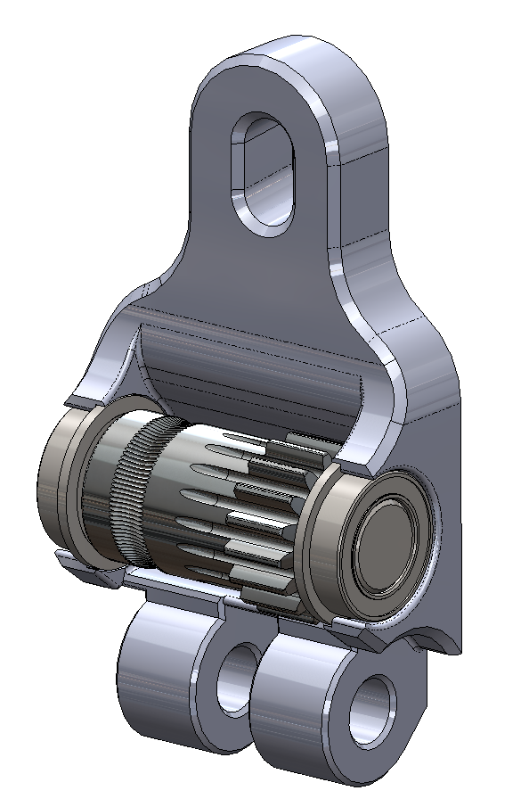

# Ball Bearing Idler Mod for Ascender

This idler latch replaces the standard 3x20mm shaft and roller bearings with a 5x20mm shaft and 5x8x2.5 flange bearings. Use retaining compound to secure the idler to the shaft. It may be a good idea to use [undersized dowel pins](https://www.mcmaster.com/97049A116/) for this.