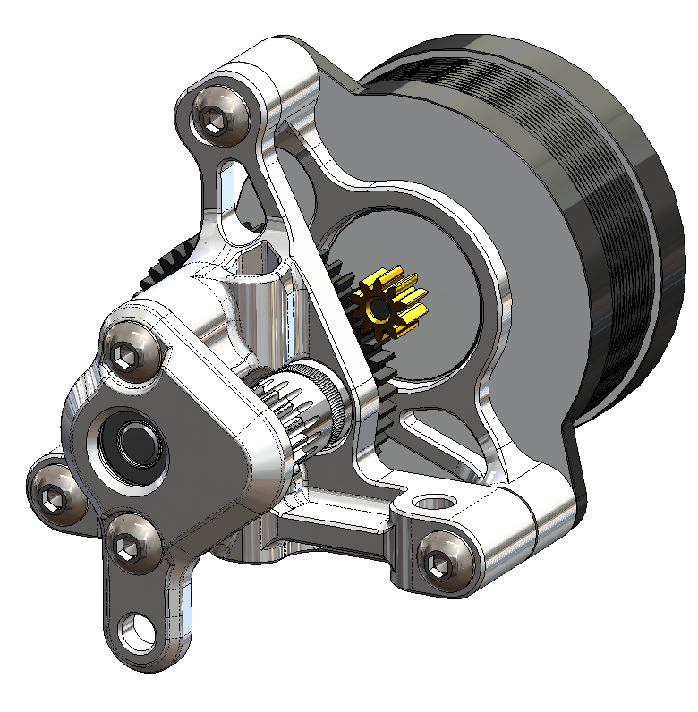
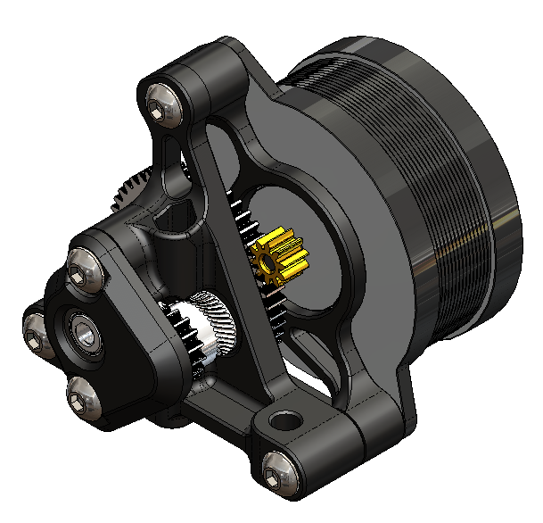

# Fixed Idler Mod for Sherpa Micro

**Compatible with:**
- Standard BMG gears
- [Bondtech RIDGA gears](https://www.bondtech.se/product/bmg-reverse-integrated-drive-gear-assembly/) 
	- ([(Fabreeko link)](https://www.fabreeko.com/products/bondtech-bmg-reverse-integrated-drive-gear-assembly?_pos=2&_psq=integrated&_ss=e&_v=1.0)
	- Requires 2x [MR84 - W2.5 (4x8x2.5mm) Bearings](https://www.fasteddybearings.com/4x8x2-5-metal-shielded-bearing-mr84-zz-2-5/)
	- [Alt bearing purchase link](https://kb-3d.com/store/magnets-bearings/807-4x8x25-metric-ball-bearing-mr84-zz-6440891415884.html)
- [Mellow vz hextrudort gears](https://www.aliexpress.us/item/3256804388574096.html) (uses standard sherpa MR85 bearings)