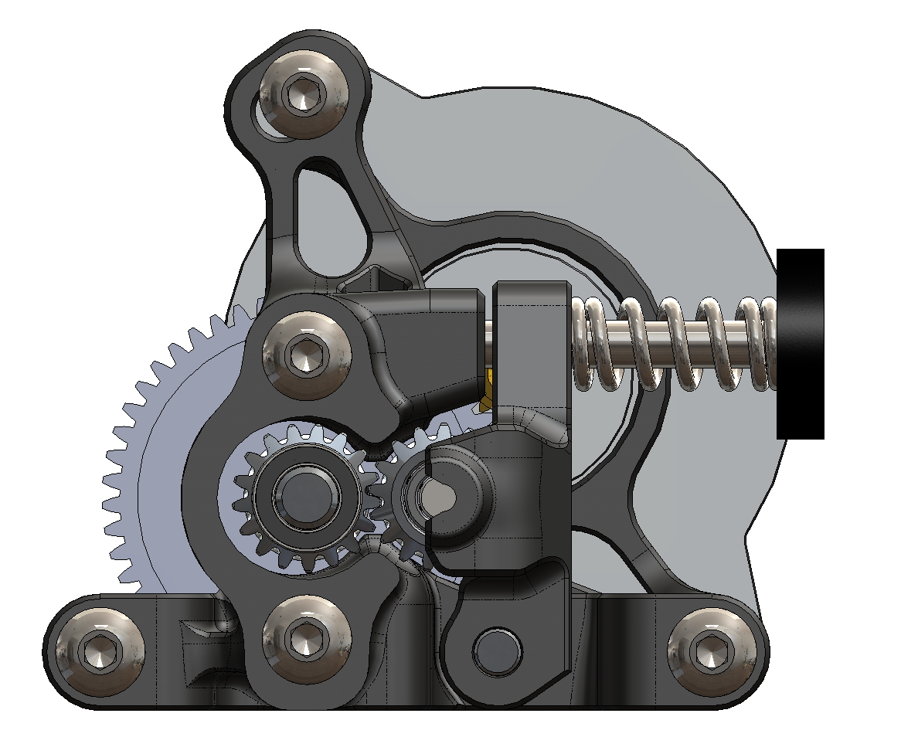

# Sherpa Mod for the Reverse Integrated Dual Gear Assembly

**Compatible with:**
- [Mellow vz hextrudort gears](https://www.aliexpress.us/item/3256804388574096.html) (uses standard sherpa MR85 bearings)
- [Bondtech RIDGA](https://www.bondtech.se/product/bmg-reverse-integrated-drive-gear-assembly/) ([(Fabreeko link)](https://www.fabreeko.com/products/bondtech-bmg-reverse-integrated-drive-gear-assembly?_pos=2&_psq=integrated&_ss=e&_v=1.0) has a 4mm shaft while the stock sherpa uses a 5mm shaft. Thus, different bearings must be used to support it. I've provided 3 options:
	- [MR84 - W2.5 (4x8x2.5mm)](https://www.fasteddybearings.com/4x8x2-5-metal-shielded-bearing-mr84-zz-2-5/) [(Alt bearing purchase link)](https://kb-3d.com/store/magnets-bearings/807-4x8x25-metric-ball-bearing-mr84-zz-6440891415884.html)the best option if you can find them, but requires the RIDGA shaft to be filed down 0.5mm on the 50T side. Requires only the housing core to be reprinted.
	- MR74 - ZZ or 2RS (4x7x2.5) Requires the RIDGA shaft to be filed down 0.5mm on the 50T side. Requires a full housing reprint
	- MR84 - ZZ or 2RS (4x8x3mm) imperfect option because they force a 0.2mm reduction in motor pinion and 50T gear engagement, but no filing needed. Requires a full housing reprint.