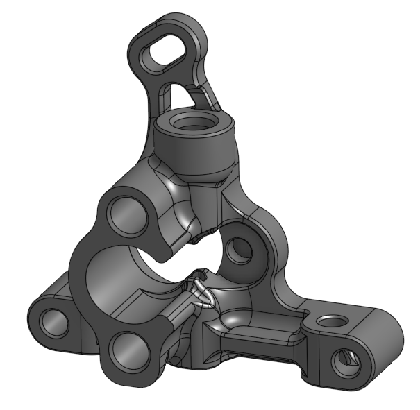

# Sherpa Micro with fixed idler and 5mm collet compatible with RIDGA v2

This modification of the [fixed idler Sherpa Micro](https://github.com/Annex-Engineering/Sherpa_Micro-Extruder) adds an additional PTFE collet to the top for better bowden retention. Collet retaining hole is based on dimensions from [Ryan G's sherpa mods](https://github.com/Annex-Engineering/Annex-Engineering_User_Mods/tree/main/Extruders/Sherpa_Micro/Extruder_Mods/Ryan_G-Idler_Filament_Sensor_and_Collet). Thanks to Anlin, Churls, and Ryan G for their designs. The housing_rear and housing_front printed parts are unchanged and can be found in the Sherpa Micro repository. A house_front_k part for mirrored Sherpa Micros is also included here.

## BOM
- Standard components for a sherpa micro as found in the Annex [sourcing guide](https://docs.google.com/spreadsheets/d/1hLOB7WidcGEu_qyc0NL_E8Wi-I3VTqyk131Jo7_nR3E/edit#gid=331700872) and additionally:

| Item                                                             | Qty Required  |
| ---                                                              | ---           |
| 5mm collet (E3D V6, Bondtech)                                    | 1             |