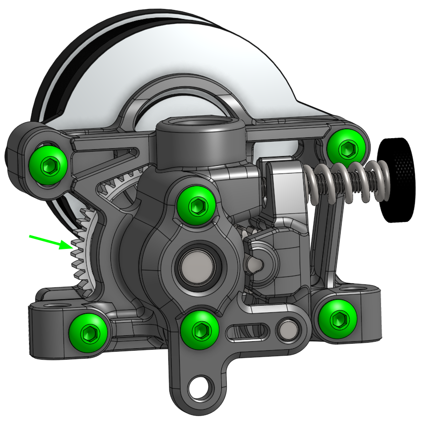

# Sherpa-Mini R2 with accessible main drive gear
This is a mod of the Sherpa-Mini R2 from Annex Engineering https://github.com/Annex-Engineering/Sherpa_Mini-Extruder/

Available with or without ECAS fitting.

It falls under the Annex Engineering [license terms](LICENSE.md) 

