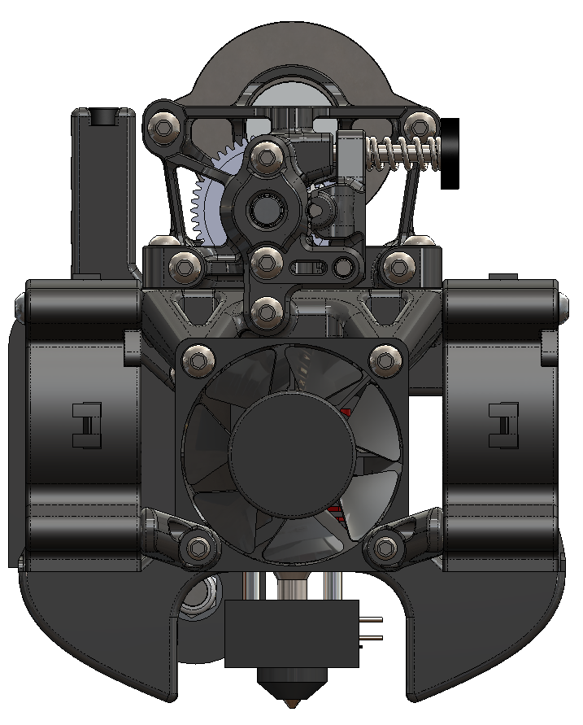

# Chubby Toolhead for the Ender 3

This is a complete toolhead for the Ender 3 (v1 carriage) that uses Sherpa Mini, QuickDraw, dual 5020 part cooling fans, and the stock creality hotend. 

5020 fans can flow roughly 50% more than 5015s while being quieter, but they require 12V.

## Parts Required

**Required**
- [Sherpa Mini](https://github.com/Annex-Engineering/Sherpa_Mini-Extruder/) with [housing_front_k](https://github.com/Annex-Engineering/Sherpa_Mini-Extruder/blob/master/STLs/FDM_STLs/optional_parts/%5Ba%5D_housing_front_k_x1_rev5.STL)
- 1x 4010 axial fan
- 2x [5020 blower fan](https://www.digikey.com/en/products/detail/delta-electronics/BFB0512VHD-F00/2560494)
- Buck converter
- 4x M3X20mm
- 6x M3x25mm
- 2x M3x16mm
- 2x M3x12mm
- 3x M3x6mm
- 2x M3 nuts
- 10X Heatset Inserts (3x5x4mm)

**Optional**
- 70W heater cartridge (the increased cooling can overwelm the stock 40W heater)
- [QuickDraw](https://github.com/Annex-Engineering/Quickdraw_Probe) 
	- Print, assemble, and install Quickdraw, dock, and holder (see [CAD](./CAD/Stiffy.EASM))
		- Set the X position of dock between the X home position and the bed with the opening facing left. There should be 2mm between the bed and the back of the dock using the stock X endstop. Using the optional x_endstop_mount.stl will allow 12mm between bed and dock. 
		- Set the Y position of dock so that Stiffy's magnets are aligned with QuickDraw's magnets when it is docked.
		- Set the Z position of the dock so that Stiffy's and QuickDraw's magnets barely touch after homing Z with the stock Z endstop. There is an optional replacement for the stock Z endstop bracket that can be used to mount the switch next to the dock holder. 
	- [Configure Klipper](./QuickDraw_klipper_config.cfg) to use Dalegaard's XZ dockable probe module
	- Note: The stock endstop locates the dock height then QuickDraw defines Z0 once the homing routine is complete.
	- Homing video: 

