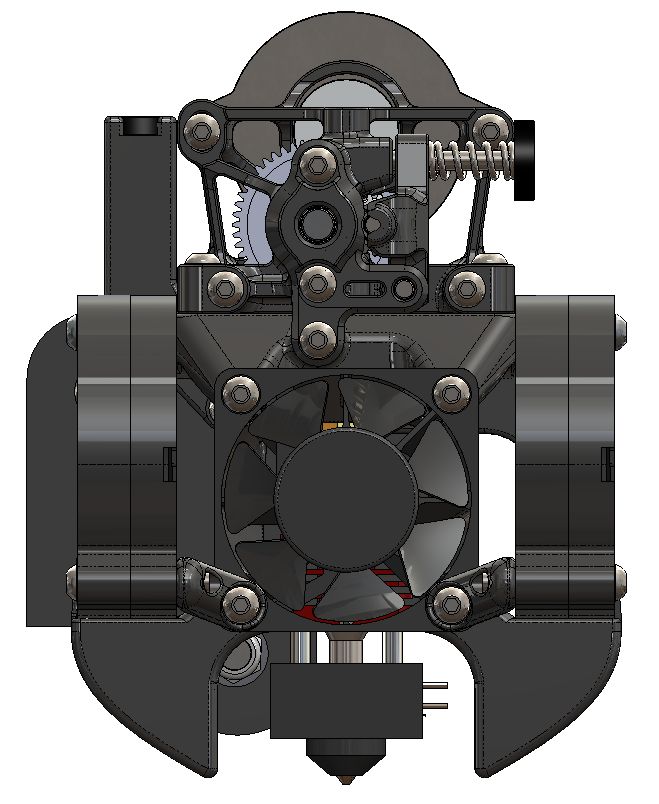

# Stiffy Toolhead for the Ender 3

This is a complete toolhead for the Ender 3 (v1 carriage) that uses Sherpa Mini, QuickDraw, dual 5015 part cooling fans, and the stock Creality hotend.

## Parts Required

**Required**
- Sherpa Mini with K front plate
- 1x 4010 axial fan (hotend cooling)
- 2x 5015 blower fan (parts cooling)
- 4x M3X20mm
- 2x M3x25mm
- 2x M3x16mm
- 2x M3x12mm
- 3x M3x6mm
- 4x M3 nuts
- 6X Heatset Inserts (3x5x4mm)

**Optional**
- [QuickDraw](https://github.com/Annex-Engineering/Quickdraw_Probe) 
	- Print and assemble Quickdraw, mini dock, and holder (see [CAD](./CAD/Stiffy.EASM))
	- Install Dalegaard's [XZ_dockable_probe.py](https://gist.github.com/dalegaard/3f1b8695275a15b1888119304d79b88d) module and modify [klipper config](./QuickDraw_klipper_config.cfg)
	- Homing video: 

