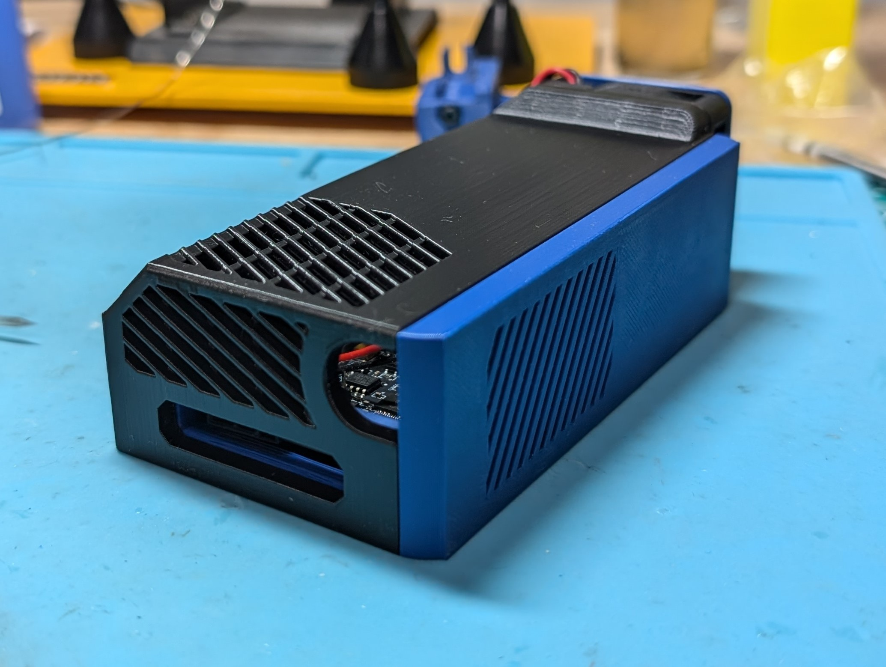
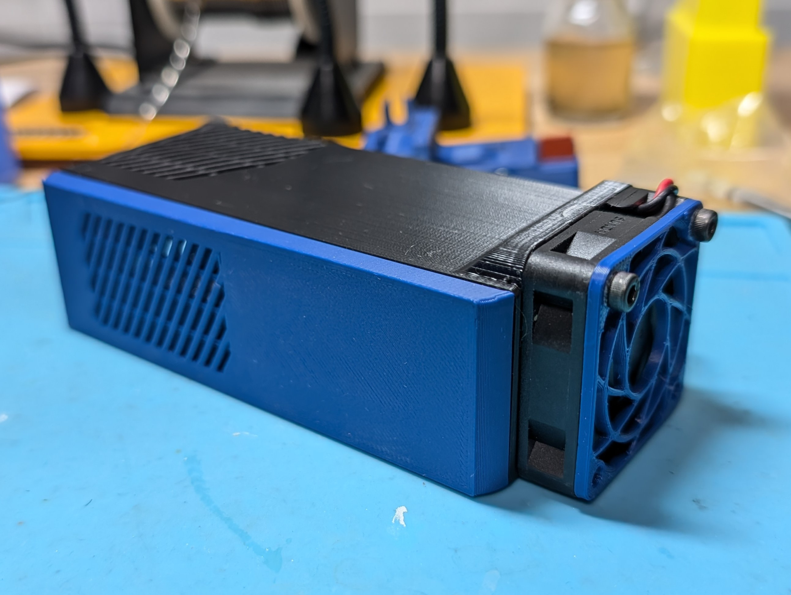
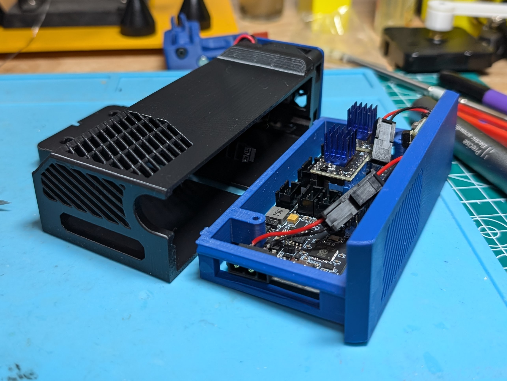
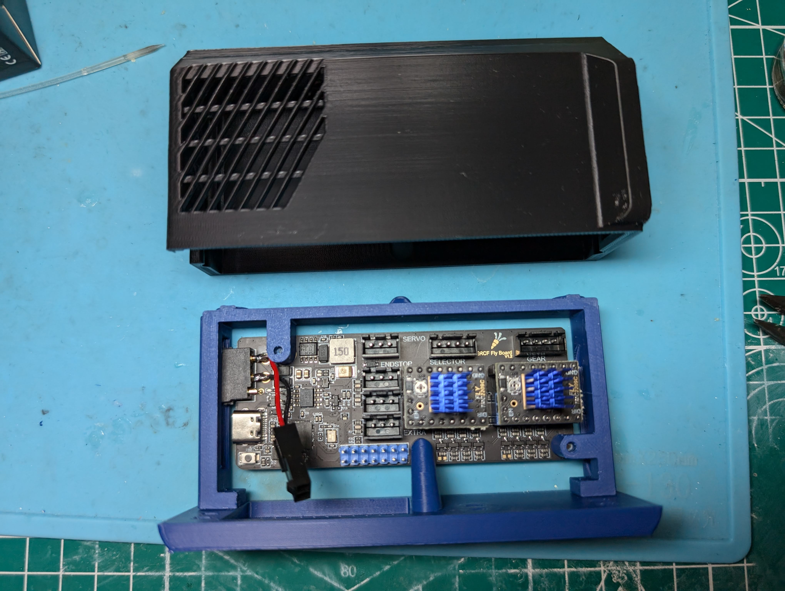
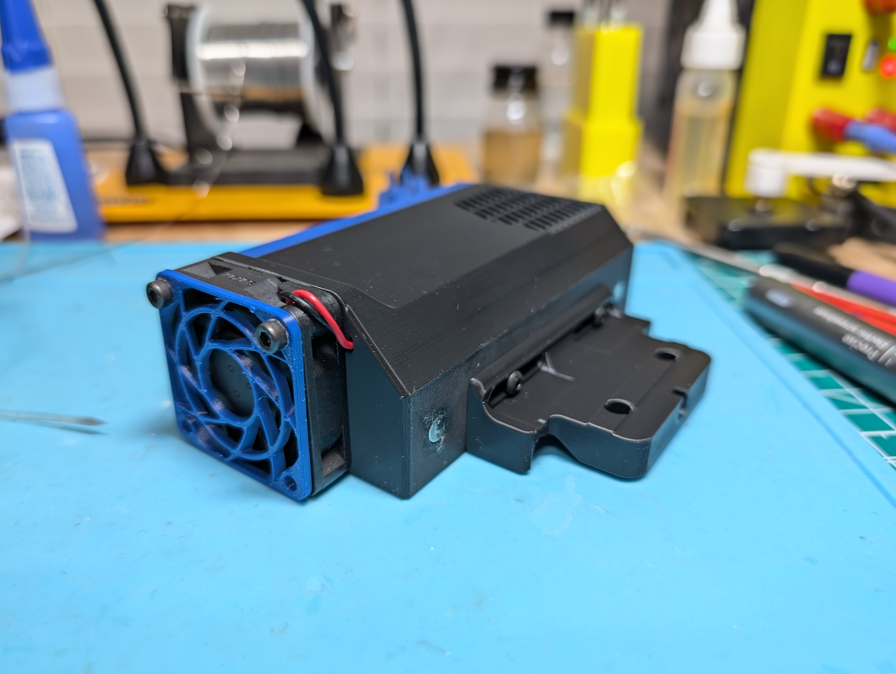

**ERCF Easy BRD Mount**
============
<table width=100%>
<TR>
<TD width=50% align="center"></TD>
<TD width=50% align="center"></TD>
<TR>
<TD width=50% align="center"></TD>
<TD width=50% align="center"></TD>
</TR>
<TR>
<TD width=50% align="center"></TD>
<TD width=50% align="center">&nbsp;</TD>
</TR>
</TABLE>

**Notes**
   - This is a mod of the official Nebula mount for TradRack that allows mounting of the ERCF Easy BRD Can board.  Credit to Ryan G for this original part as it is super cool and very nicely designed.
   - Since the BRD board is much narrower and slightly longer, this version increases the width slightly and makes it much less deep.  It removes the bowden tube used as guiderails, changes up the 4010 fan inlet slightly

**BOM**
   - (4) 6mm x 3mm magnets
   - (8) m3 x 8mm screws (preferably BHCS, although SHCS should also work)
   - (2) m3 x 16mm bolts
   - (6) m3 x 5mm x 4mm heat sets
   - (1) 4010 fan

**Build Instructions**
   - Print the STLs in the provided orientation
   - Glue the two tray pieces together.  The pegs should be keyed to prevent gluing in the incorrect direction.
     - note there are several ziptie cutouts in the Tray Face, and also one in the back of the pocket.
   - Figure out how you will power the fan.  
     - I am going to use a buck converter (MP1584EN Adjustable 3A DC-DC Converter)
       - https://www.aliexpress.us/item/3256805684077964.html
       - To power the buck, I soldered wires to the 24v power input legs on the back of the power connector.     
       -  I used a Sunon MF4010v2-1000U 12v fan (because I already had it) and I further down-volted it to 8-9v.  
       - Note: the buck in the pictures isn't the one linked because it hasn't arrived yet.  There should be enough space to zip-tie it to the tray front. 
     - Alternatively, run some wires from your main board, or maybe use a Sunon 4010 5v fan (on the Tradrack BOM) and run it at 3.3v using the GPIO pins?
   - Attach the BRD board with (3) m3 x 8 mm bolts going up through the bottom of the board.
   - Screw in the m3x8 SCHS in the bottom of the tray after the tray is in the pocket.
   - Glue in the magnets to the tray and the Pocket
   - Melt in the (6) heat sets and attach the mount bracket with (4) m3 x 8 mm screws.

