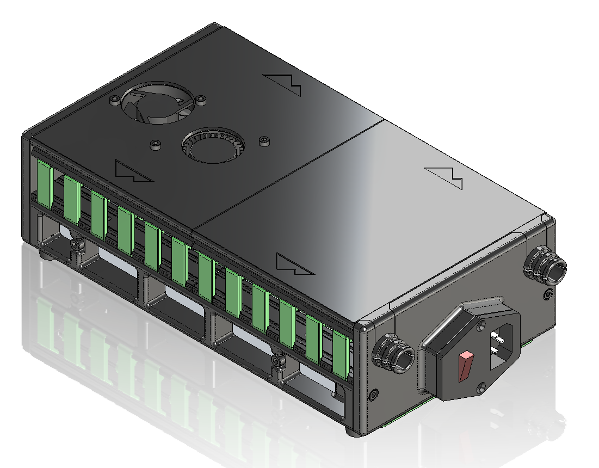
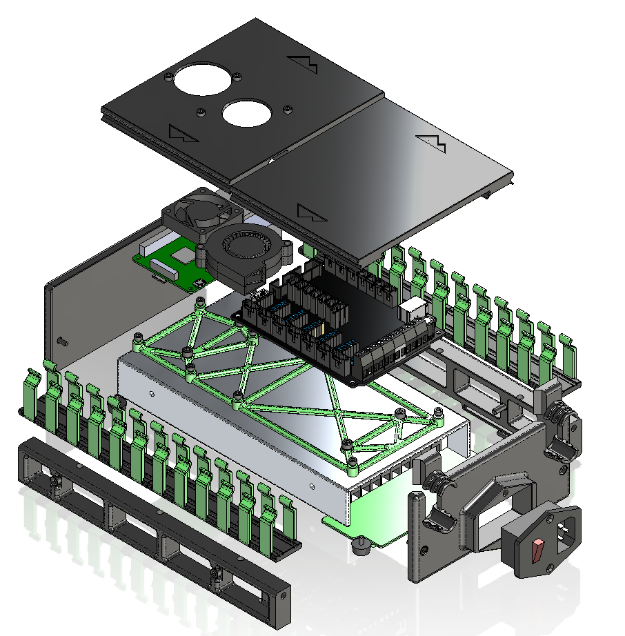
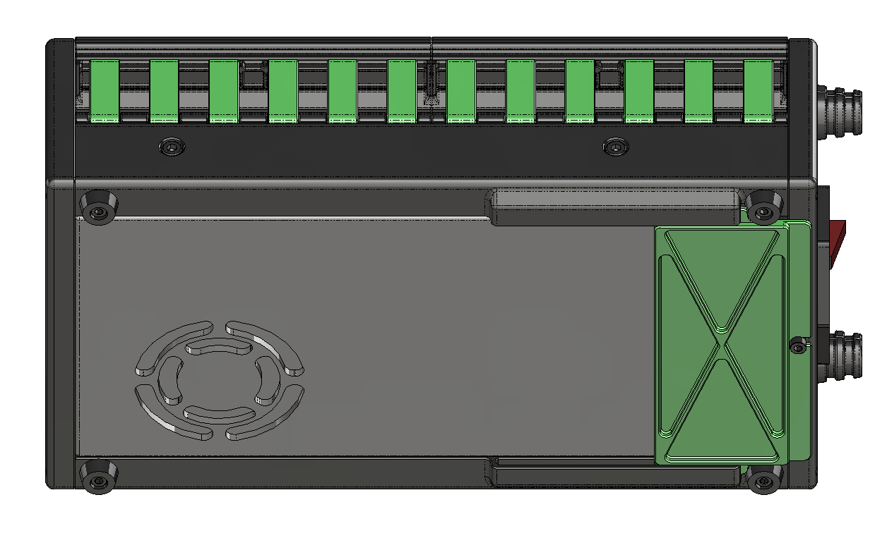

# LRS Electronics Box

This is a minimal electronics enclosure that uses a power supply as a frame. The base configuration is 80mm H x 145mm W x 270mm L and contains:
- Meanwell LRS-350-24 power supply
- Fysetc S6 motherboard
- Raspberry Pi 4
- 4010 axial fan
- 5015 blower fan

The idea here is that the simple design can be reconfigured to suit other components that fit on top of the PSU. Credit to Papejelly for the cable channels.