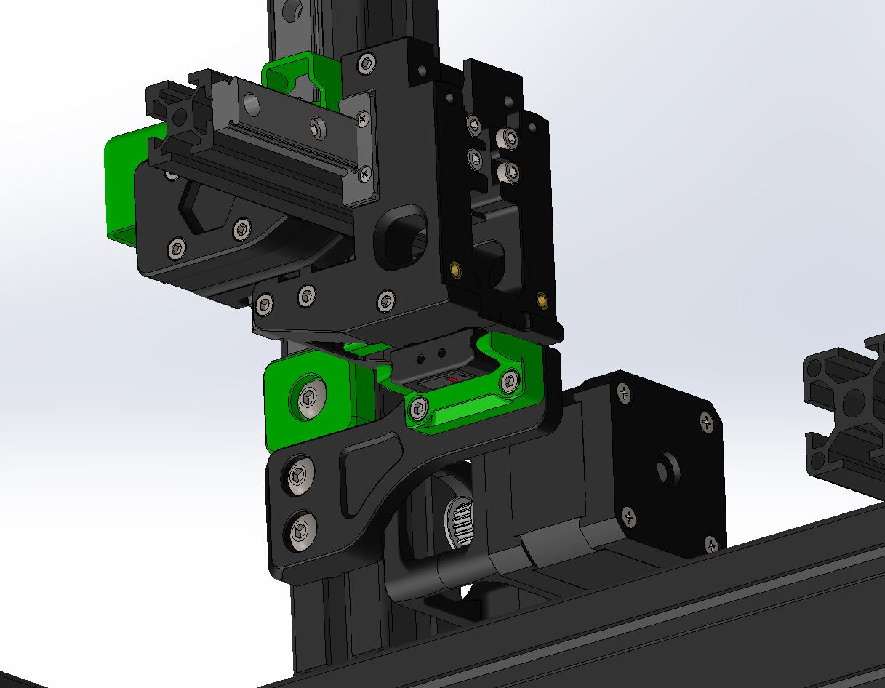
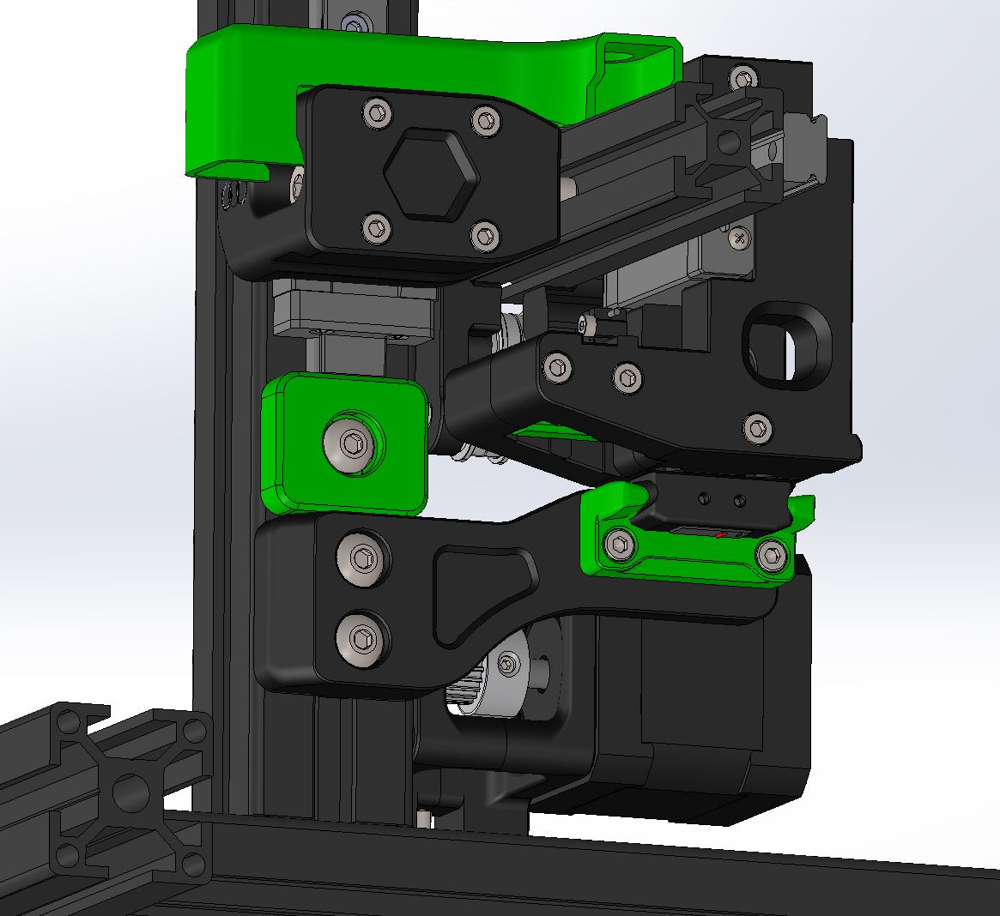
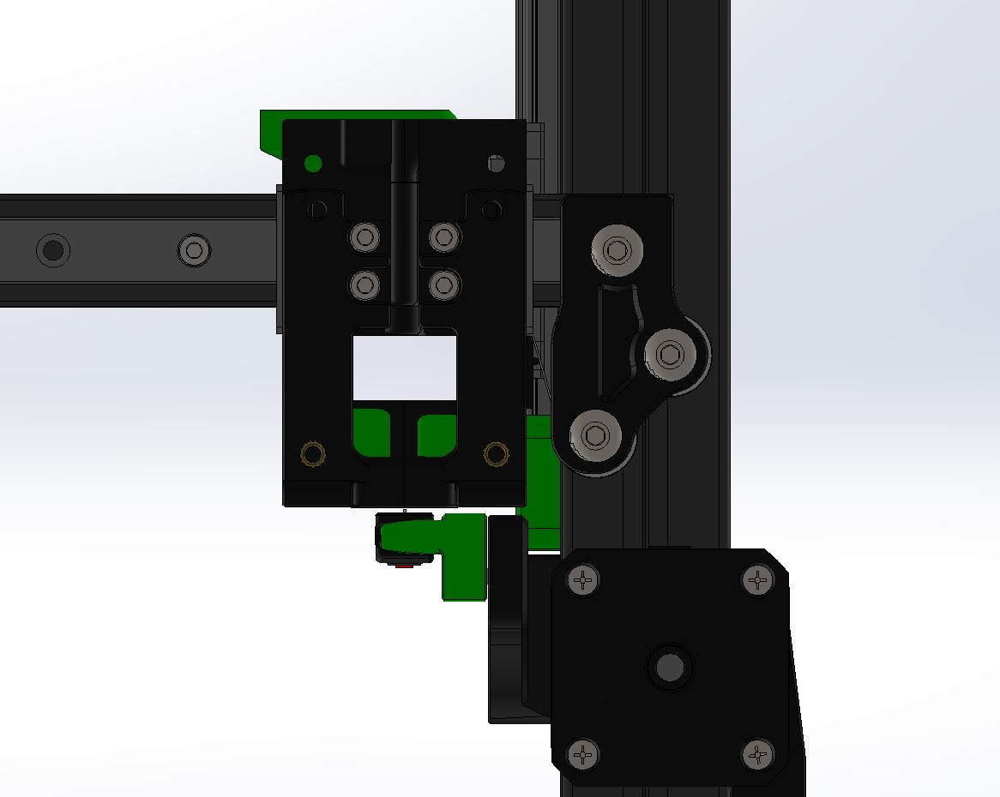

# Magprobe for Switchwire MGN12H

The magprobe replaces the inductive probe. This new probe is able to probe any surfacetype and isnt affected by magnets. 
Secondly its able to function as z endstop. No changing of the z offset anymore when swapping buidplates of different thickness.

You will need to configure your switchwire to do an intial z home before probe pickup from the dock. Few ways of doing this is mounting a z max endstop or a special z min endstop. 

[Probe housing can be found here.](https://github.com/Annex-Engineering/Quickdraw_Probe/blob/main/STLs/omron_d2f-5_microswitch_probe_body_x1_rev3.STL)

## Hardware needed: 
- 2x M2x8 self tapping screw 
- 10x 6x3 magnets 
- Omron D2F-5 (No substitutes!) 

## Images:
### Left/Front

### Left/Rear

### Rear

## Discord
Do you have any design suggestions or ideas? We would love to hear! You can join us at https://discord.gg/MzTR3zE

