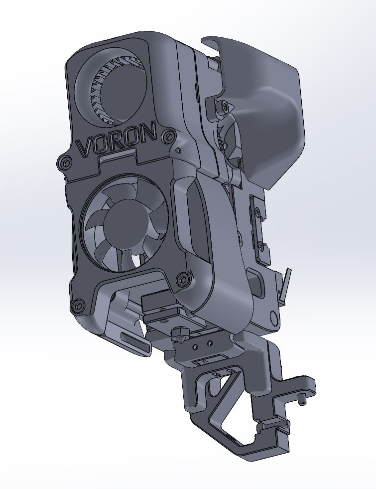

## Afterburner x carriage with magprobe - single MGN12 rail

## What is it?
This modified x carriage integrates a magprobe. Both IGUS and Generic cable chains are supported. A bigger rear exhaust has been realised. This new probe is completely solderless and has many benefits such as actually probing the surface of the buildplate and great repeatability. The dock can be mounted stationary or onto the gantry (See the experimental folder).
For pickup detection probe_query or a circuit with the dock can be made. No buildvolume is lost since the probe can be docked in the 10mm y overtravel of the V2.4

## Credits
MGN12H version is based  on the VoronUsers [MGN12 mod by Arkeet](https://github.com/VoronDesign/VoronUsers/tree/master/printer_mods/arkeet/mgn12).

## Hardware needed:
- 4x M3 nut
- 2x M2x8 self tapping screw
- 10x 6x3 magnets
- Omron D2F-5 (No substitutes!)
- 4x DIN912 M3x12
- 2x DIN912 M3x8

## Resources
Installation instructions magprobe: https://github.com/Annex-Engineering/Quickdraw_Probe
 

## Discord
Do you have any design suggestions or ideas? We would love to hear! You can join us at https://discord.gg/MzTR3zE