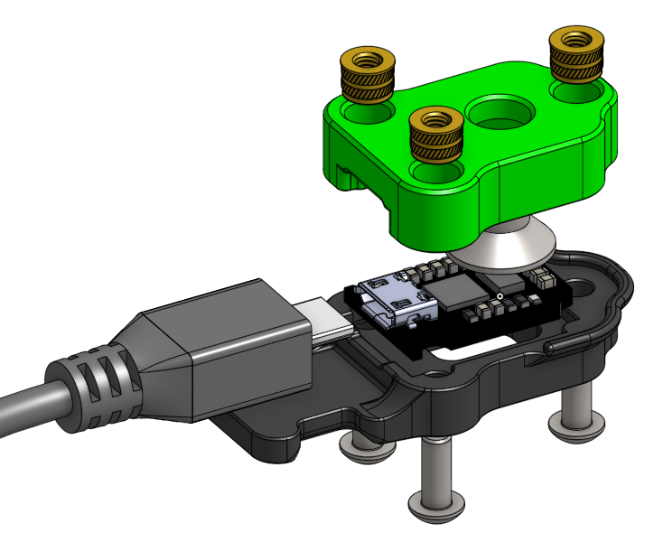
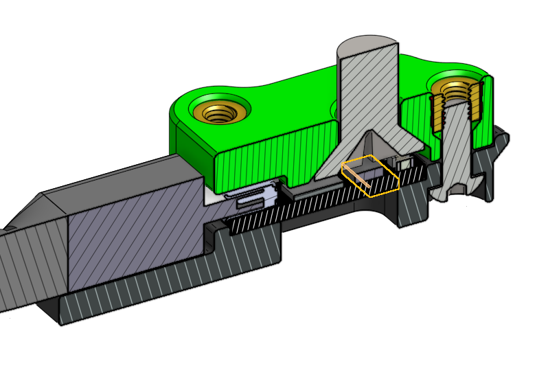
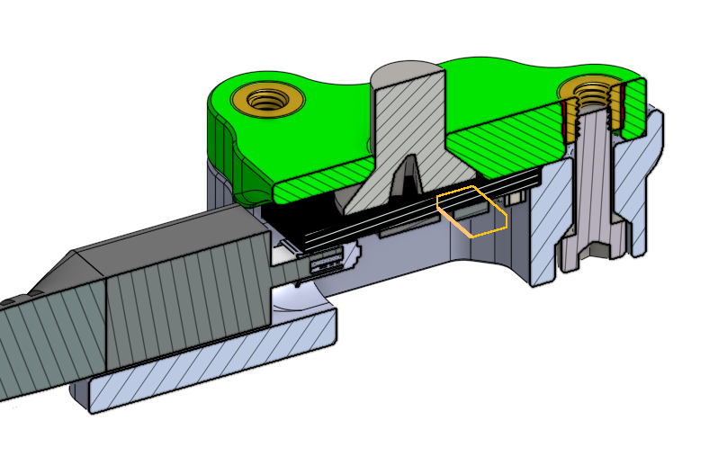
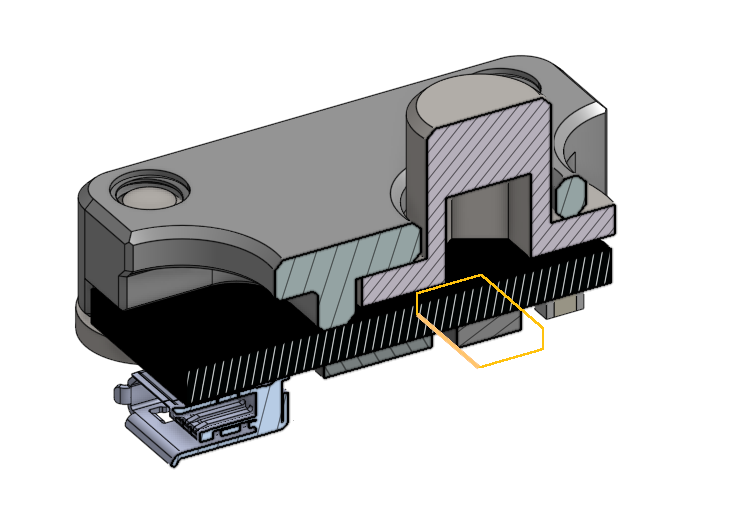

# Nozzle Mount for Crampon

A Crampon mount that attaches to the hotend and positions the accelerometer at the nozzle tip position. The standard Crampon mount provided on the [Annex Engineering PCB GitHub](https://github.com/Annex-Engineering/Annex_Engineering_PCBs/tree/master/crampon/Clampon_Mounting_Bracket/) is too wide to fit between the part cooling fans on a K3 and has the accelerometer offset from the nozzle. This version fixes those issues.

Two versions for the bottom printed part are available for USB cables with 6mm and 8mm thick housing on the connector.

## Goals
- Positions the ADXL345 accelerometer at the nozzle tip
- Minimizes weight while still being easy to install (work in progress)
- Fits on the K3 carriage without hitting the part cooling fan ducts or Beacon probe
- Works with 6mm and 8mm thick USB cables

## BOM
- Sources for all items can be found in the Annex [sourcing guide](https://docs.google.com/spreadsheets/d/1O3eyVuQ6M4F03MJSDs4Z71_XyNjXL5HFTZr1jsaAtRc/htmlview#) for the K3 or at the official Annex Stores ([US](https://store.annex.engineering/), [EU](https://annex-engineering.eu/))

| Item                                                             | Qty Required |
| ---                                                              | ---          |
| Crampon PCB                                                      | 1            |
| M6 x 10mm or 12mm Flat Head (included with Crampon)              | 1            |
| M3 x 8mm SHCS or BHCS                                            | 3            |
| M3 x 5mm Dia x 4mm Length Heat Set Insert                        | 3            |
| Micro USB Cable with 6mm or 8mm thick housing                    | 1            |
| Cable Tie                                                        | 1            |

## Notes

Relative position of ADXL345 chip (highlighted) and nozzle mounting bolt:

| This Version | Standard | Legacy (Minimal) |
| --- | --- | --- |
|  |  |  |

- The PCB recess in the bottom printed part is 1.4mm, so the Crampon should sit 0.2 above the lip so that it is in contact with the top printed part.

## Assembly
1. Insert three M3 heat set inserts into the top printed part.
2. Insert Crampon PCB into the bottom printed part.
3. Attach USB cable to Crampon and zip-tie USB cable to the strain relief tab on the bottom printed part.
4. Remove nozzle from the hotend.
5. Attach the top printed part into the hotend thread using a M8 flat head bolt.
6. Attach the bottom printed part using three M3 bolts.

