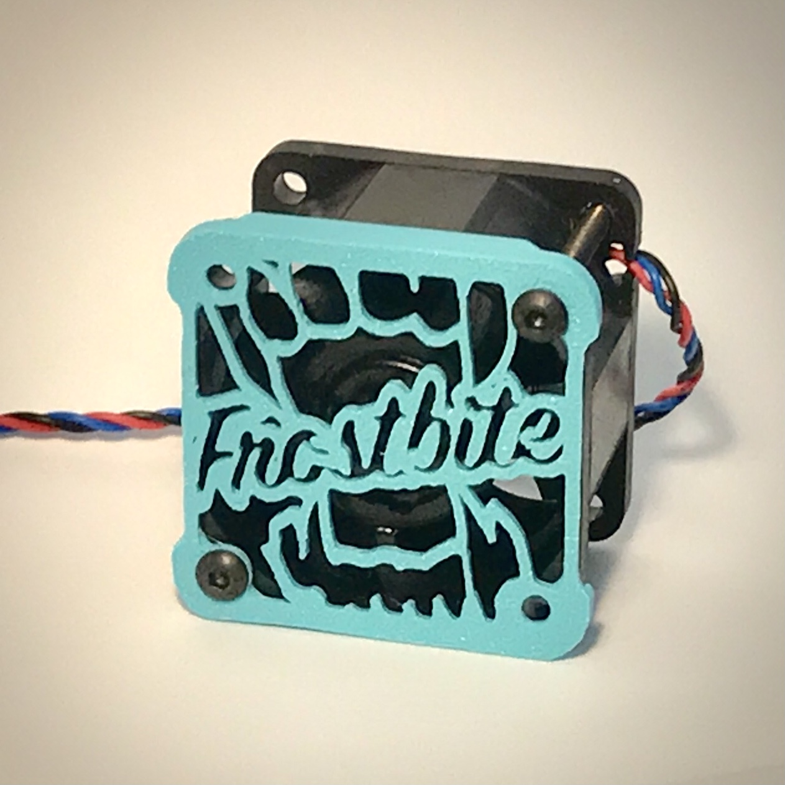
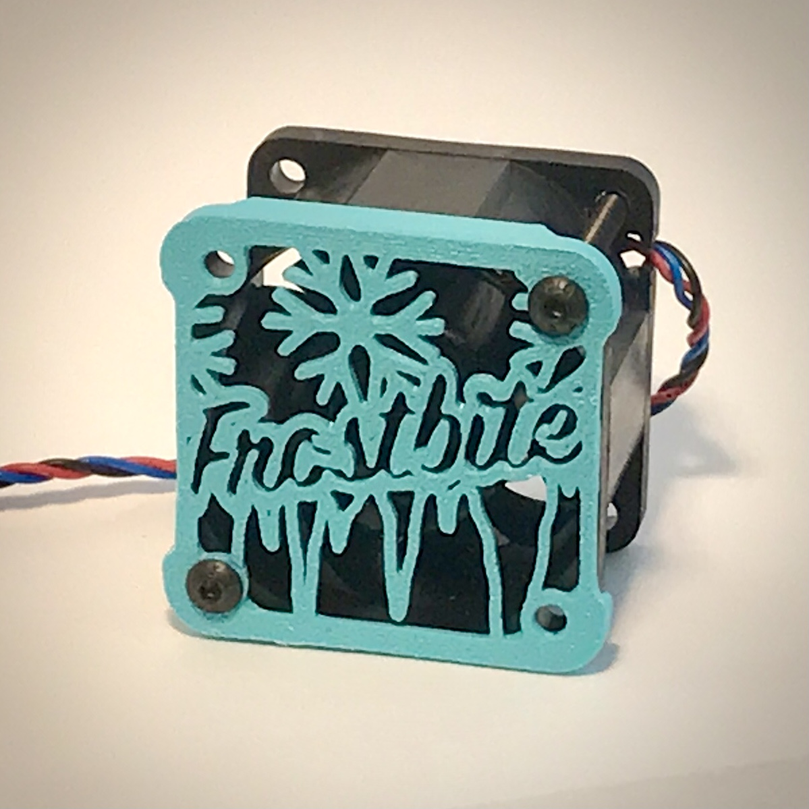

# Frostbite Fan Covers
Put a new face on your Frostbite toolhead!
Choose either an icy face or one with more bite. Both a slim fan cover in the original depth, and a standoff version with 5mm depth for more airflow are available.

