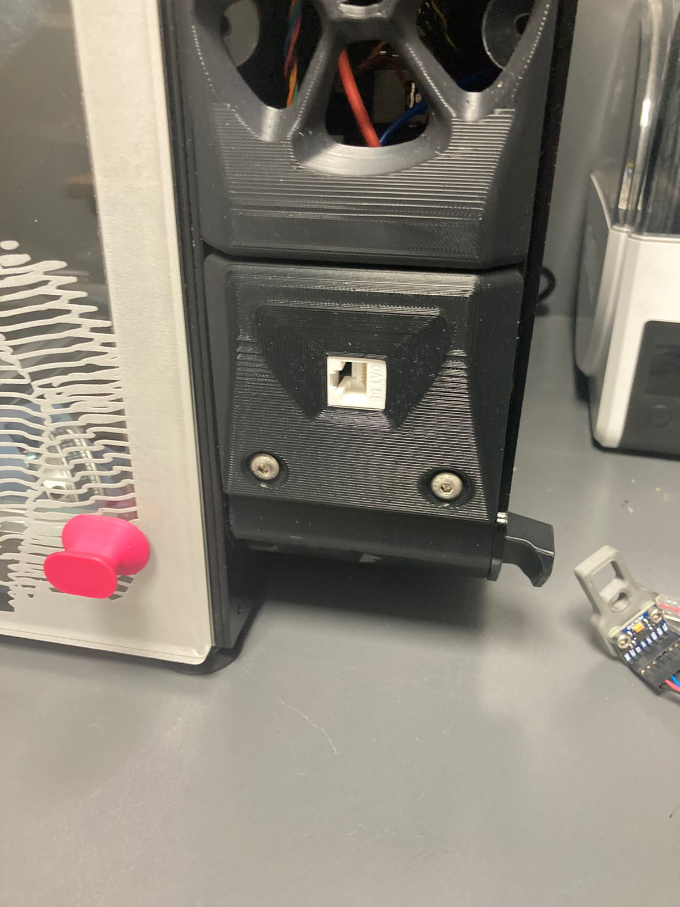
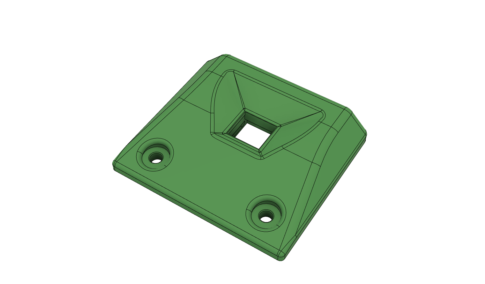
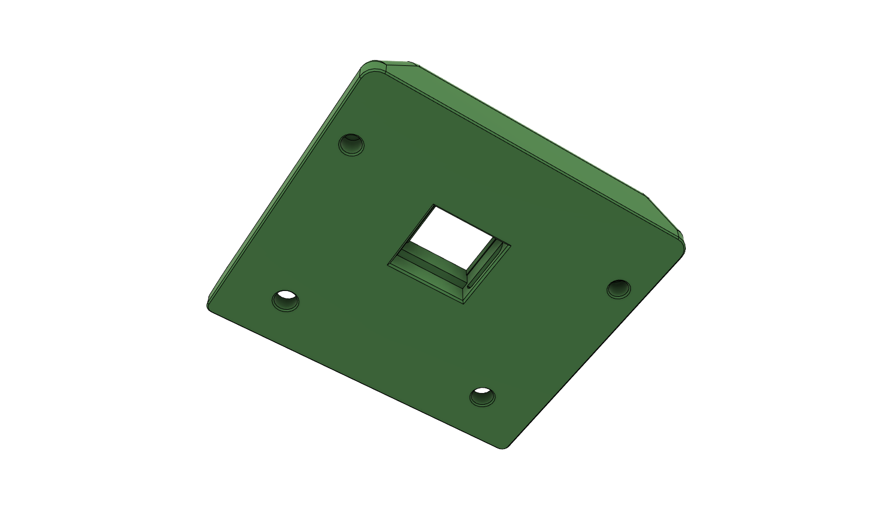
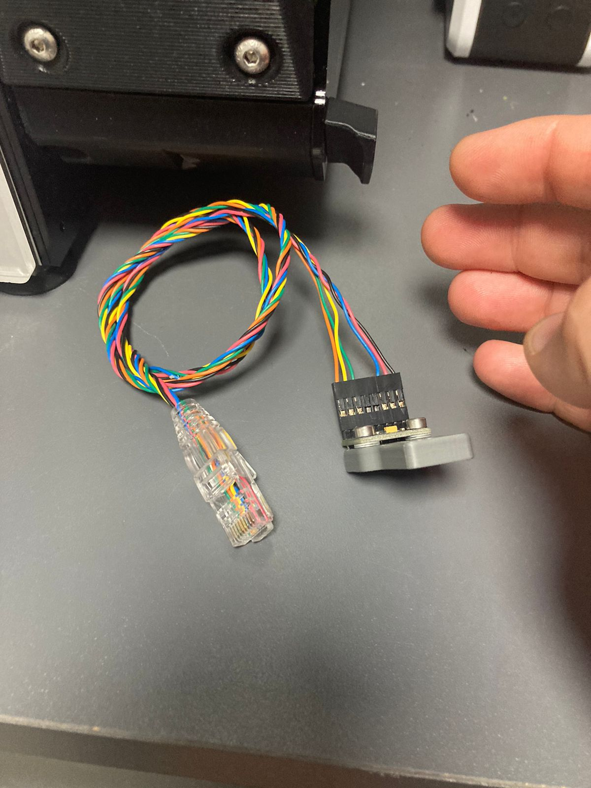
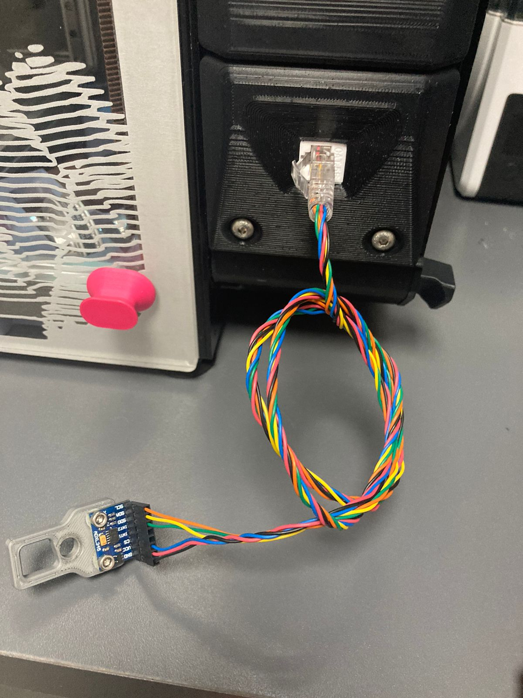

## Cat5 keystone panel [Like this one](https://scoop.co.za/linkbasic-cat5e-utp-keystone-jack.html)

I get annoyed having to wire up the ALDX to do input shaping, and having to do it for each printer. So I used a CAT5e keystone to create an interface which so far seems to be working well. 

I just pinout 1-6, and then crimp the respective wires to match into the CAT5 connector. You can always use a multimeter in continuity mode to confirm each wire matches up. 

### Print settings
- Perimeters 4
- Infil > 50% infill
- Infil type rectilinear
- Solid Top/bottom layers (4+)
- Layer height .20mm 

