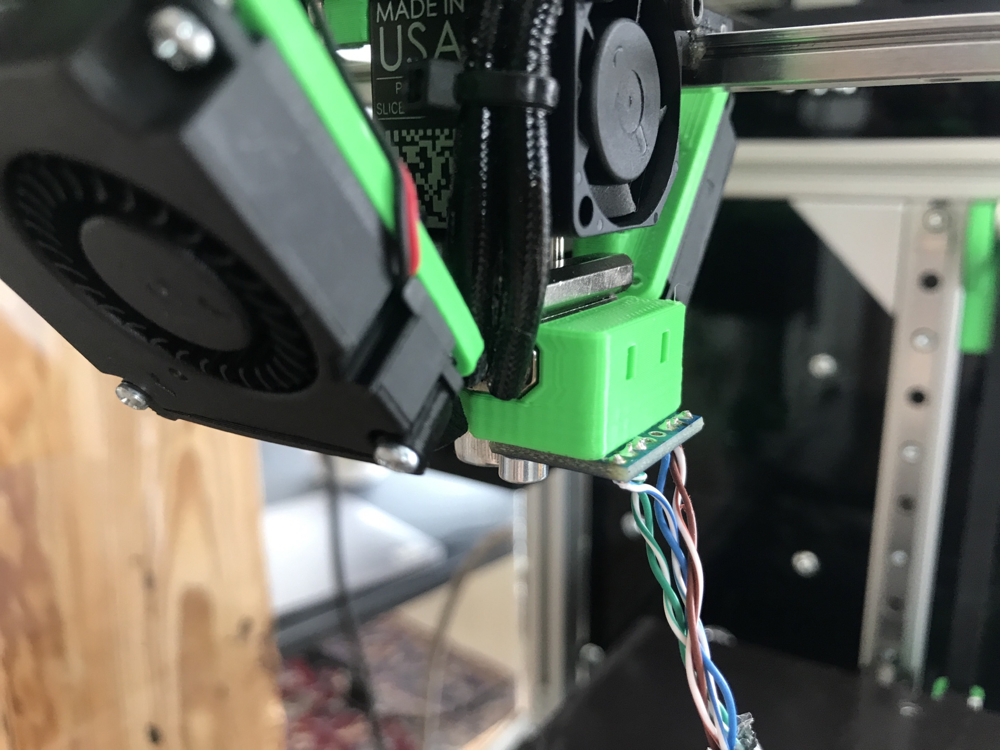
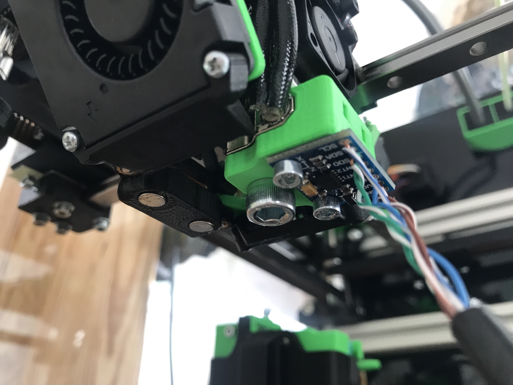

# ADXL345 Holder for the Slice Egineering Mosquito Hotend

- 2x M3x6, 1x M6x10 SHCS
- 2x short M3 Heatserts from the K3 BOM
- Optionally, you can use a cable tie for wire strain relief.
  You would have to solder the wires/connector on to the other side of the adxl then.

