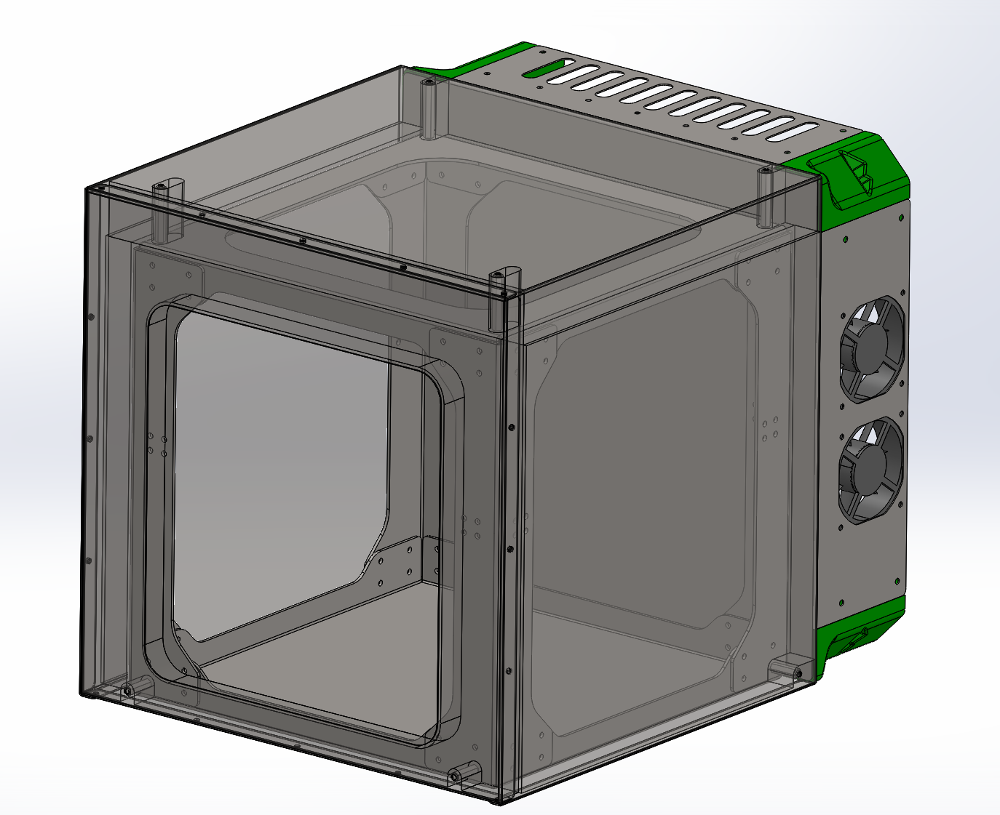

# Athena Enclosure

A steel frame designed such that its outer surface is thermally isolated as much as possible from the rest of the machine. This also allows the enclosure to be quickly released from the machine for service.
Requires a press brake and a turret punch or laser to be manufactured.

## Photos

