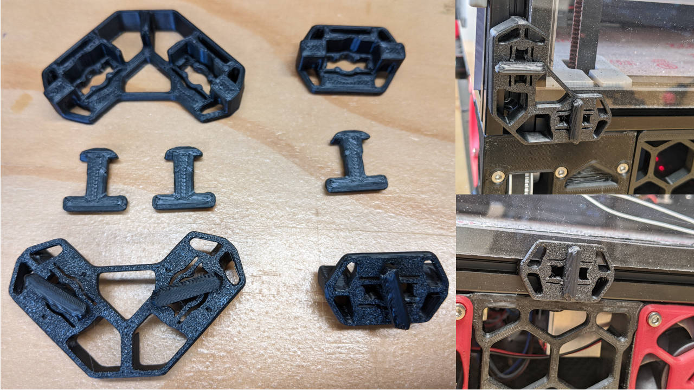

# Panel clips and hinges

Redesigned and improved panel clips. Based on Voron 2.2's panel clip design.

all parts designed by Anlin on the Annex Discord

## Panel clips

They hold panels against the aluminum extrusions with a twist lock. They require no extra hardware, and are quick to install and remove.

The number in the filename is the thickness of the panel to secure. A panel of 3mm with 1mm of foam will be a total of 4mm.
You need two keys per corner clip, and one per single clip. For a 4mm thick panel with 4 corner clips and 4 single clips you would print:
 - panel_clips_and_corners/corner/STL/corner_lock_body_4.STL ×4
 - panel_clips_and_corners/single/STL/lock_body_4mm.STL ×4
 - panel_clips_and_corners/key/STL/key_asymmetric_4.STL ×12

## Hinges

The hinge base plates lock into the extrusion at 90°. The base plate size must clear the panel perpendicular to the hinged panel.
And for the hinged panel, the hing size is the thickness.

BOM per hinge:
 - M5x40
 - F625 bearings ×2
 - 1mm M5 washer ×2
 - M5 nylock nut (or M5 nut and threadlocker)
 
Mounting stack:
 M5x40-> F625 -> side plate -> 1mm washer -> hinge arm -> 1mm washer -> side plate -> F625 -> M5 nylock nut

## Panel support

They hold the panel at the bottom. And the top can be held by latches.

## Latches

BOM per latch:
 - M5x40
 - M3x30 ×2
 - M3 heatset insert ×2
 - F625 bearings ×2
 - M085 bearing
