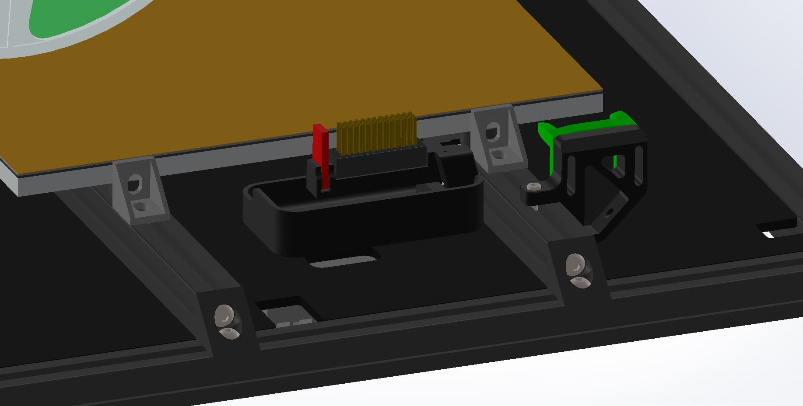
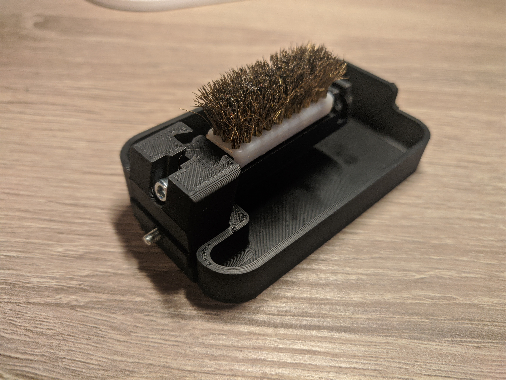
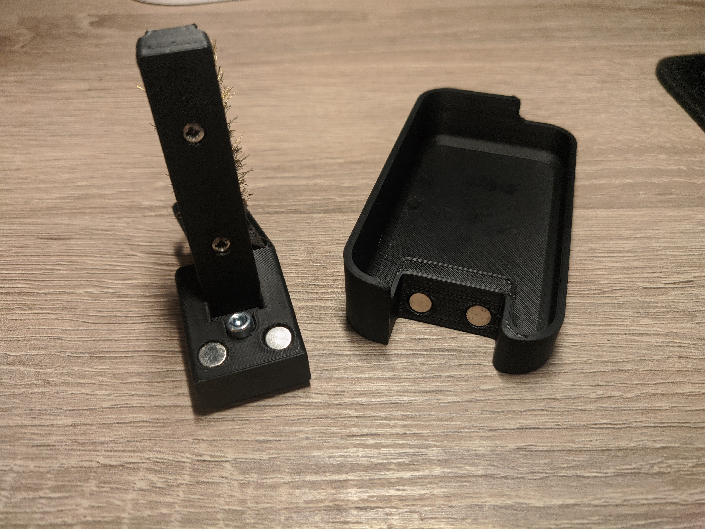

## Purge brush bucket

## What is it?

A purge brush bucket with some nice extra's. The tray is magnetically removeable. The brush and silicone wiper can be height adjusted. It mounts directly against some 2020 extrusion.

## Hardware needed:
- 4 6x3 magnets
- 1 M3x5x4 heatinsert
- 2x DIN912 M3x8
- M2x8 self tapping screws (go into the bottem of the brush)
- High temperature silicone flap

## Discord
Do you have any design suggestions or ideas? We would love to hear! You can join us at https://discord.gg/MzTR3zE
