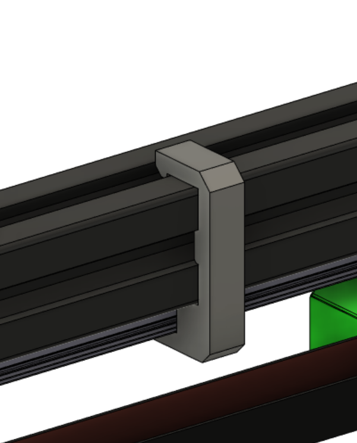

# 2020 Extrusion Rail Aligners

These allow for quick and easy alignment of 9mm or 12mm wide linears rails backed by standard 2020 profile extrusions.
Recommended to print in a material with a bit of flex, such as PET/PETG.

 

