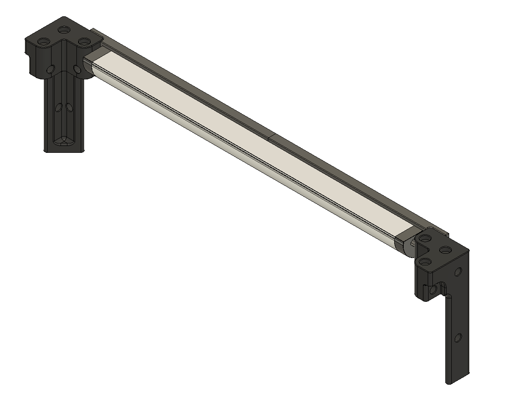
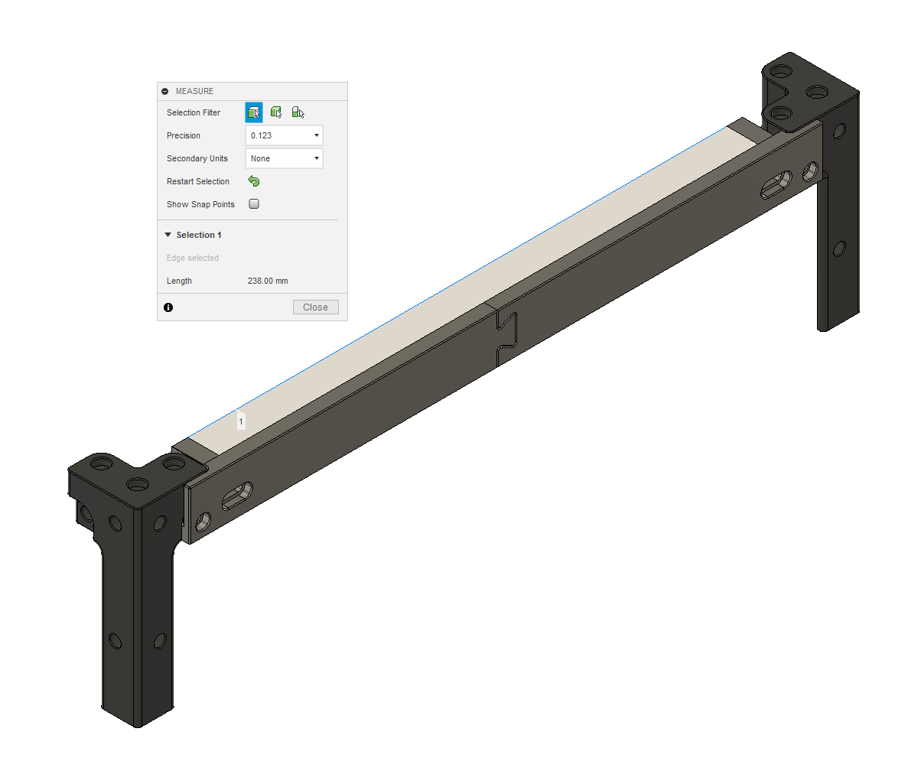
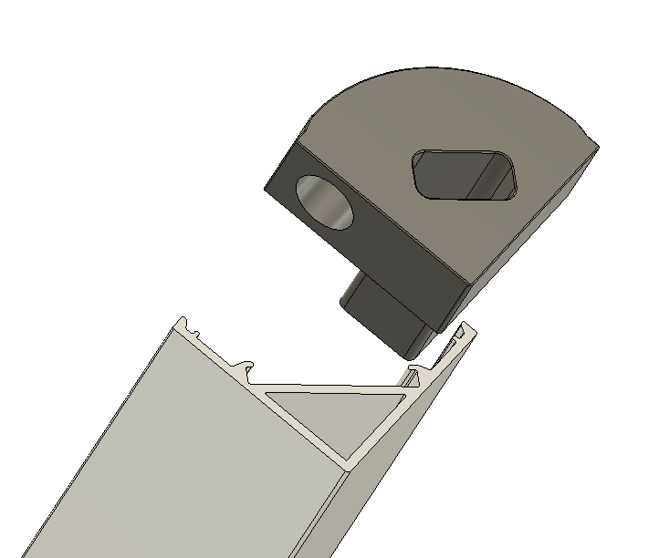

# Tophat Corner LED Bar

| Thing      | Quantity (for two sides) |
| ----------- | ----------- |
| Heatsets      | 8       |
| M3X8   | 8        |
| LED Channel   | 2 Cut to Length        |
| LEDs   | Cut to Length        |

LED Bar that is tucked away in the tophat corner pieces.
Heatsets go in each end cap and corner piece in the same location that the front door magnet heatset does.

LED Channel needs to be cut to 238mm. The mount has slots to account for inaccurate cuts that make the channel SHORTER than 238mm.

Depending on the LED Channel you get, you will need to adjust the triangle endcap nub.

