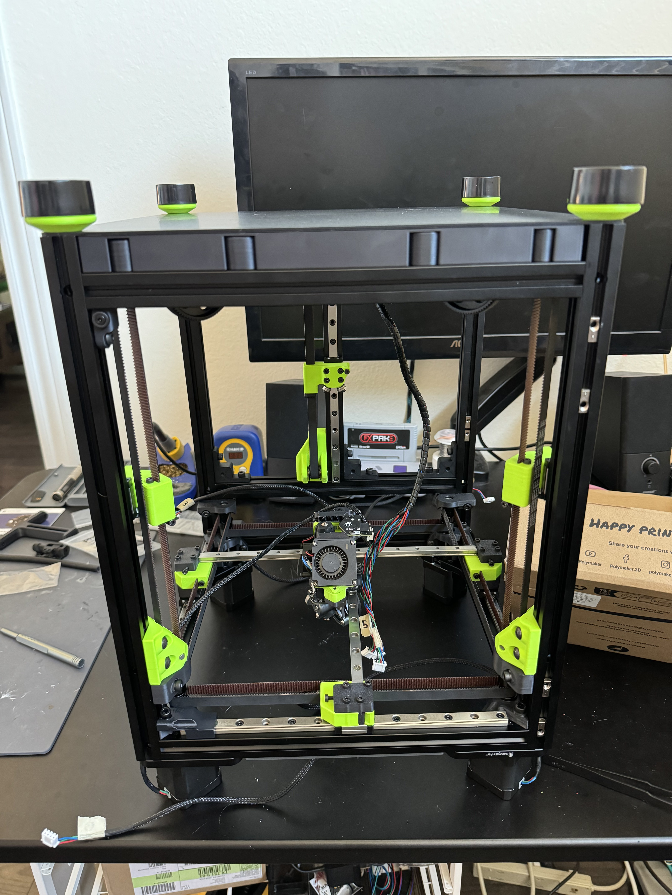
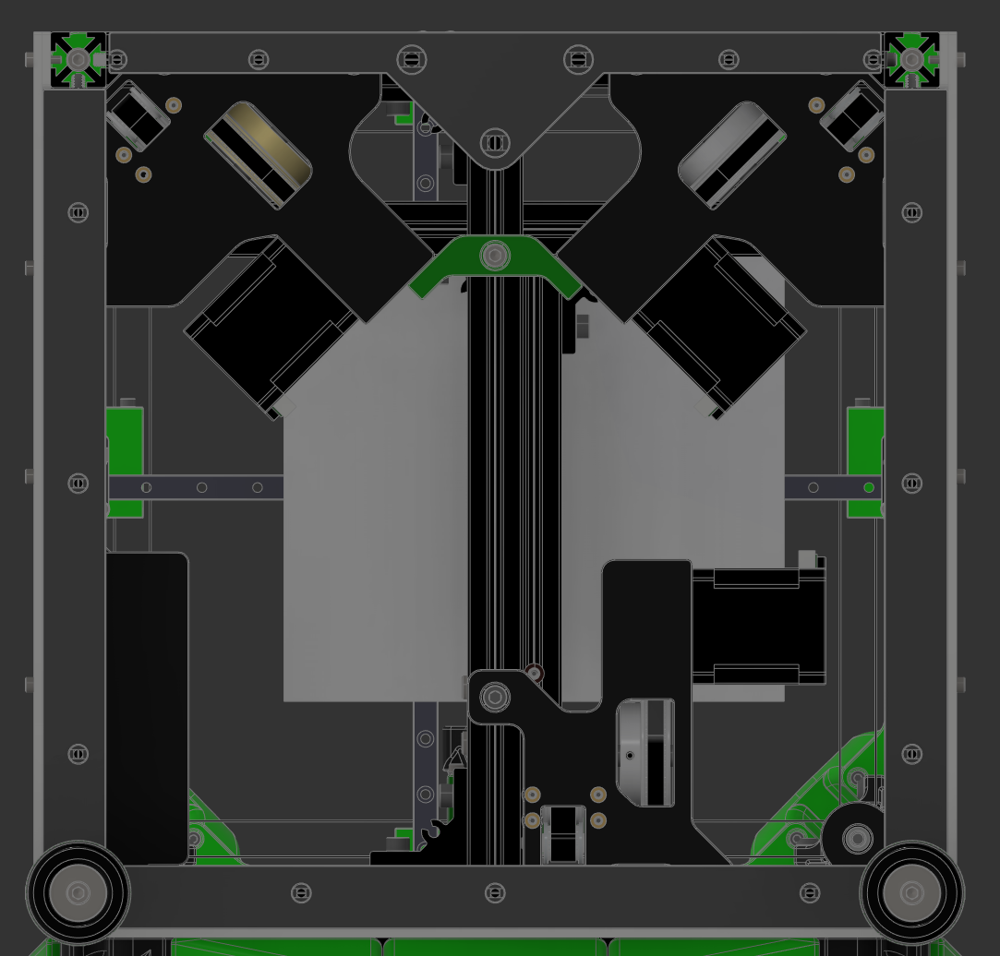

**Bottom Seal**
============

### Notes
- This mod both provides bracing and a surface to apply foam insulation to for a better door seal
- Prevents having to affix adhesive directly to the Annex door which imo ruins the aesthetic
- Seals up the space between outer and bottom panel 
### Printing
- Standard Annex settings