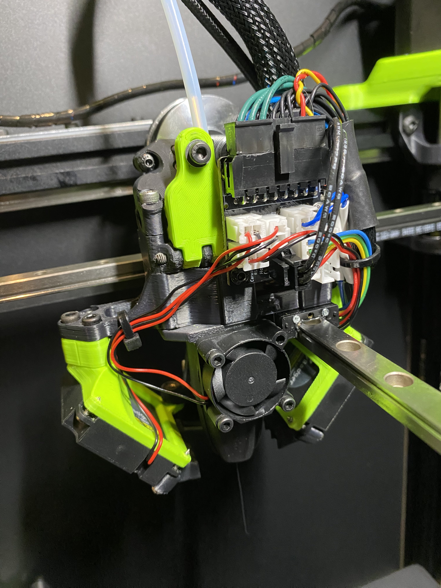

**K3 DFA Carabiner Mount**
============
<table width=100%>
<TR>
<TD width=50% align="center"></TD>
<TD width=50% align="center"></TD>
</TR>
<TR><TD COLSPAN=2 align="center"></TD></TR>
</TABLE>
- Notes
   - Carabiner mount integrated with toolhead carriage.  
   - Included CAD / STL is for Dragon style hotends
- Printing
	 - Standard Annex settings
- Assembling
	 - Uses 2 M3x4x5 heatset inserts
	 - Install the upper insert from the back