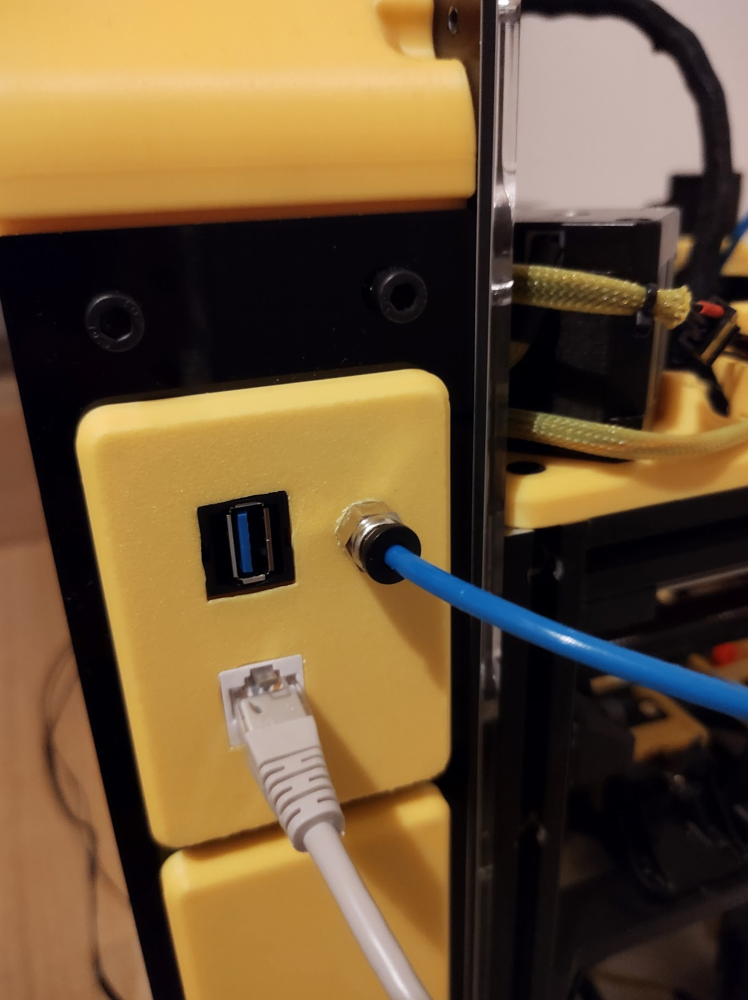

# Blanking Plates

A collection of blanking plates quickly created in Tinkercad
to use on my K3. Keystones are in various sizes and types.

I used one for ethernet and USB for my Raspberry Pi.

The OLED screen are cheap to source on Amazon. You can connect them
to your spider directly or to your Raspberry Pi as MCU in klipper.

# Double keystone

# Double keystone with PTFE holder

# SSH1106 OLED 1.3" screen

