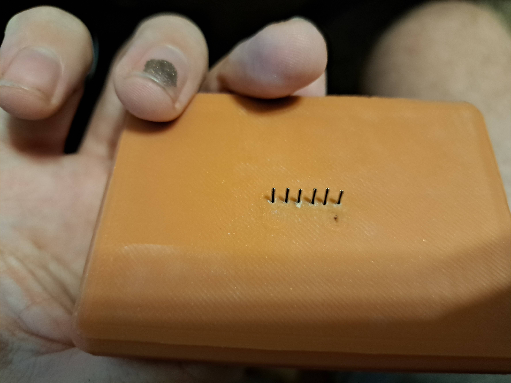

**ADXL headers for Electronics Box**
============
<table width=100%>
<TR><TD width=50% align="center"></TD>
<TD width=50% align="center"></TD>
</TR>
</TABLE>

- Notes
   - Uses generic jumper for breadboards (such as: https://www.amazon.com/dp/B07GD2BWPY/ ). Use the male -> female connectors for this.
   - Secure jumper wire on the inside with some hot glue, for mounting permenantly.
   - Wire jumpers to your raspberry pi for ADXL usage.
   - Connect to JST XH 6 pin connectors for ADXL connection.
   - Two notches included on print to use as reference for 'up' corresponding with the two notches on a JST XH connector.
- Printing
   - Requires a well-leveled bed. Any over-extrusion and you will close up the holes for the header pins. If that happens, you can gently use the header pins themselves to drill/bore a hole through potentially...
