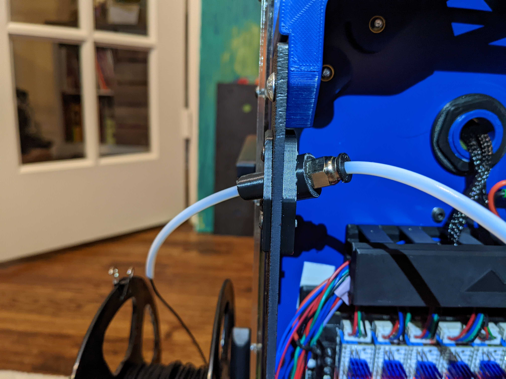
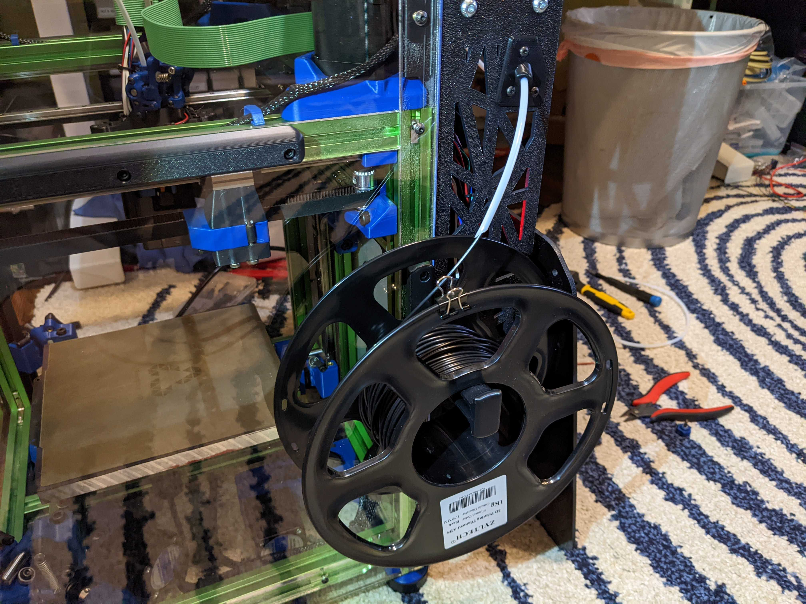

**Backpack Rightside PTFE Guide**
============
<table width=100%>
<TR><TD width=50% align="center"></TD>
<TD width=50% align="center"></TD>
</TR>
</TABLE>

- Notes
   - I wanted to be able to mount the spool on the right side of the machine.  
   - Since there's no blanking plates on the right side of the backpack, I used one of the bigger decorative holes.
   - Uses a typical pass through bowden retainer (PC4-m10-0.9)
- Printing
	 - The Mandala Roseworks backpack panels I have measure 3.2mm thick, so the spacer is 3mm thick.  You may need to adjust the thickness of the spacer to your panels.  
