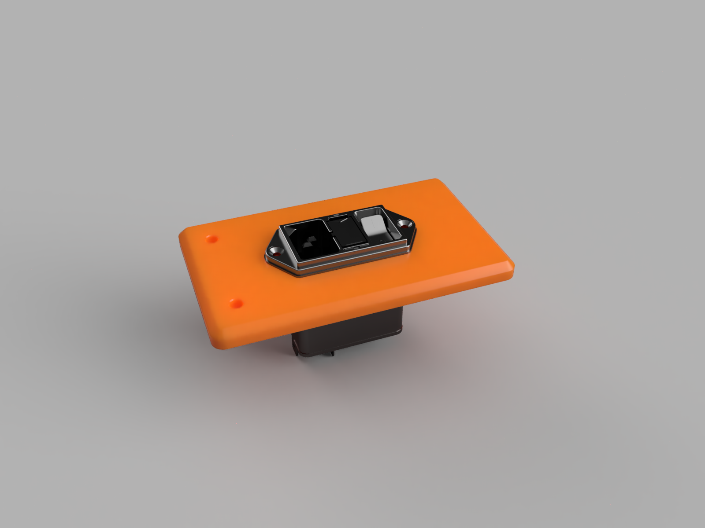

# Electronics Box Schurter DD12 filtered inlet
This is a plate to fit a Schurter DD12 filtered inlet (vertical version) into a K3 backpack.

[Datasheet](https://www.schurter.com/en/datasheet/DD12)

## BOM
You will need the following parts in addition to the screws used by the plate in the K3 backpack:
| Part                                                                                            | Quantity |
| ----------------------------------------------------------------------------------------------- | -------- |
| M3x6 FHCS                                                                                       | 2        |
| [M3 Brass Heat Stake Threaded Insert - Short (5x4mm)](http://s.click.aliexpress.com/e/oMUr6YsC) | 2        |
| Schurter DD12 inlet (vertically mounted version)                                                | 1        |
| Schurter DD12 fuse drawer (part no. 4301.1403)                                                  | 1        |
| 5x20mm Fuses                                                                                    | 2        |
