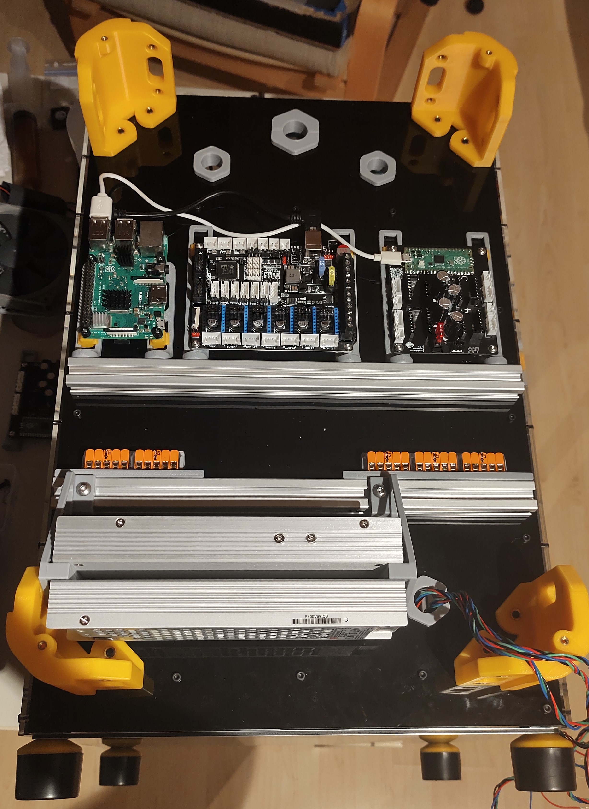

This is a modded bracket to accomodate dual UHP power supplies (200W) for hybrid K3s that use 48 and 24V.
It offsets the PSUs such that it clears the bottom grommet and the corner piece to allow for more flexibility in the placement.

