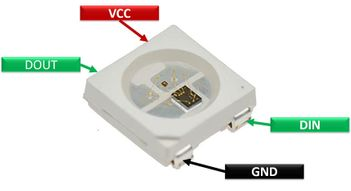
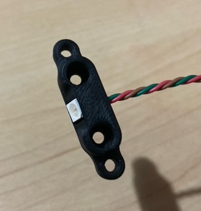
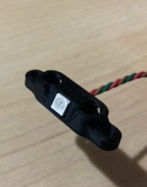
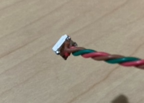
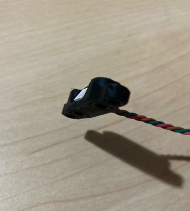
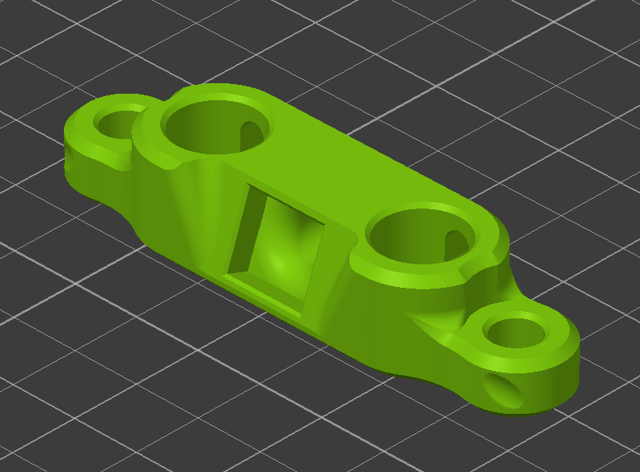

## K3 Mag Probe Mount LED

Adding a RGB WS2812B LED to light up your nozzle is simple. Add one to your mag probe mount, and enjoy!

### Print settings
- Many perimeters >= 4
- Infil > 50% infill
- Infil type rectilinear
- Solid Top/bottom layers > 4
- Layer height 0.1mm 

### Notes
- Make sure you connect the wires to the corrosponding pin. Refer to the pinout and note the triangle when connecting the wires 

- You only need to connect
  - GND
  - VCC (5V+)
  - DIN (Data In)
- Solder the wires to the inside of the LED
- Cut the excess wire stickout out beyond the LED flush using sharp side cutters and prehaps even a hobby knife (Cut away from yourself)
- When fitting the LED
  - First ensure that you can feed the wire through the mount and that the LED seats properly
  - The LED fits best in a particular, so test until you find the ideal orientation
  - Wire the LED up and test it with an ardiuno or printer board to confirm it's in working order
  - Unplug the LED
  - Last step is to secure it in place with a drop of superglue on the back of the LED
  - Wait some time before using it to ensure the glue dries, or use a superglue activator to speed up the process. 
  - Do all the RGB things
   

