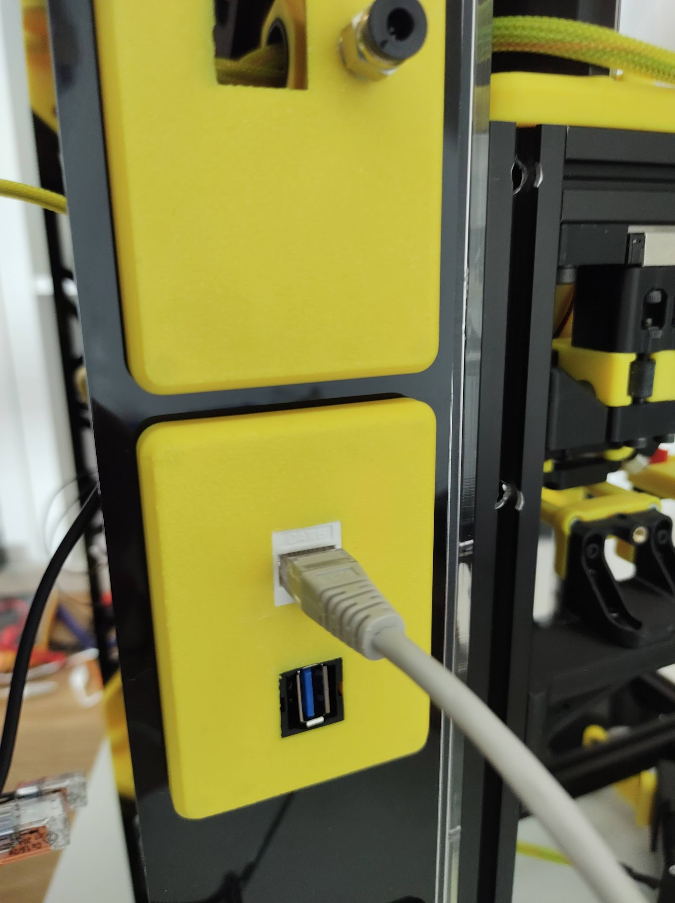

# Blanking Plates

A collection of blanking plates quickly created in Tinkercad
to use on my K3. Keystones are in various sizes and types.

I used one for ethernet and USB for my Raspberry Pi.

# Double keystone

# Double keystone with PTFE holder

