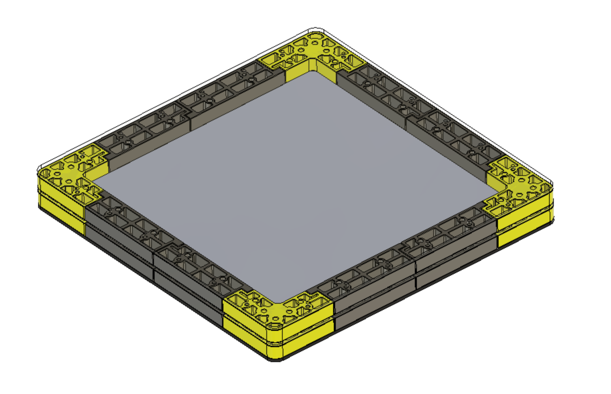
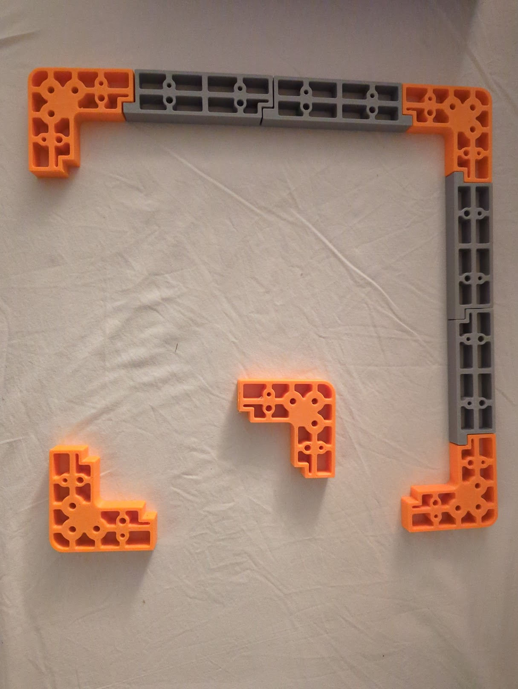
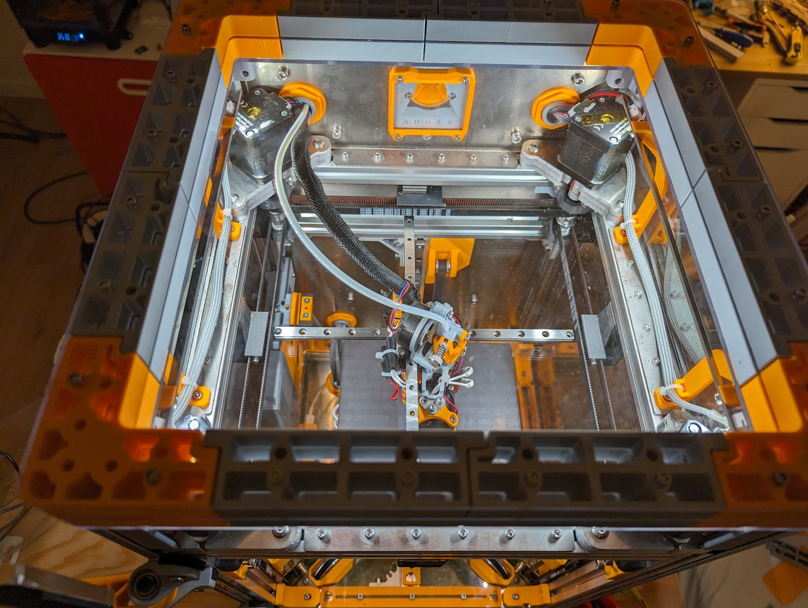

# Double pane tophat

An overkill tophat for the K3 with the possibility to do double or triple panel
with air in between for a bit of extra isolation.

The default setup consists of one bottom panel, a middle panel and a top panel.
It needs quite a large number of heat inserts and M3 bolts.

It's a heavy tophat which is quite sturdy compared to the original tophat.
Hope you like it!

# BOM for double pane

- Top - 24x M3 heat inserts (5mm OD - 4MM length)
- 24X M3 30mm
- Bottom - 24x M3 heat inserts (5mm OD - 4MM length)
- 24x M3 16mm
- Magnets - 12 M3 heat inserts (5mm OD - 4MM length)
- 12 FHCS M3 screws for magnets
- Tophat - 12 countersunk magnets 8mm
- Corners - 12 countersunk magnets reverse polarity 8mm

# Prints
- 8x Corner
- 8x Spacer1
- 8x Spacer2
- (Optional) Front door seal 1 + 2 (seals door better)
- 4x CornerWith8mmMagnets (replaces stock corners so you can use countersunk magnets)
- 12x Magnet spacer (adjust height accordingly)

# Pictures

