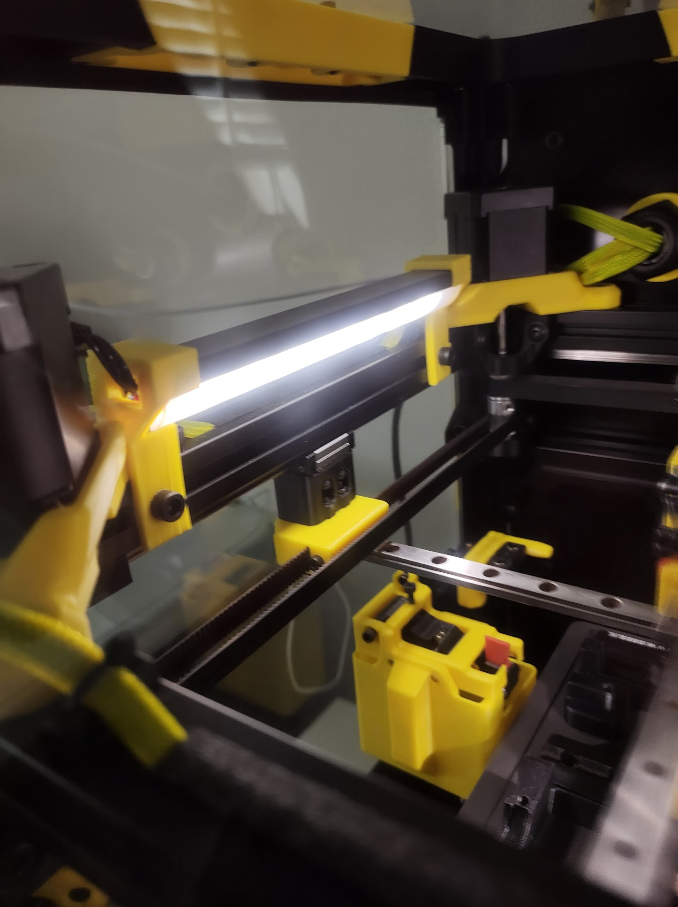

# LED profile mounts

Mounts I designed for mounting LED profiles on my K3 printer.
You will need 18mm led profiles. You can cut the led profiles
on whatever length you want for this mounts. There are holes
on the side for the wiring.

Just mirror the STL in your slicer for left and right mounts.

# Setup
