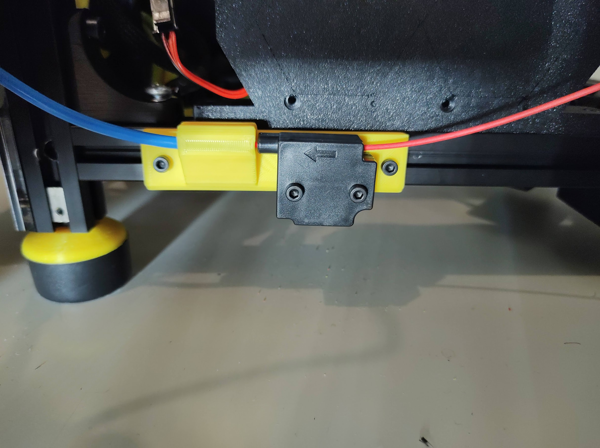

# PTFE tube guide and runout sensor mount

A mount to put on two side panel bolts to guide your PTFE tube and put a runout sensor on to.
Needs two M3x5 heat inserts for the runout sensor bolts. Quickly hacked together in Tinkercad.

