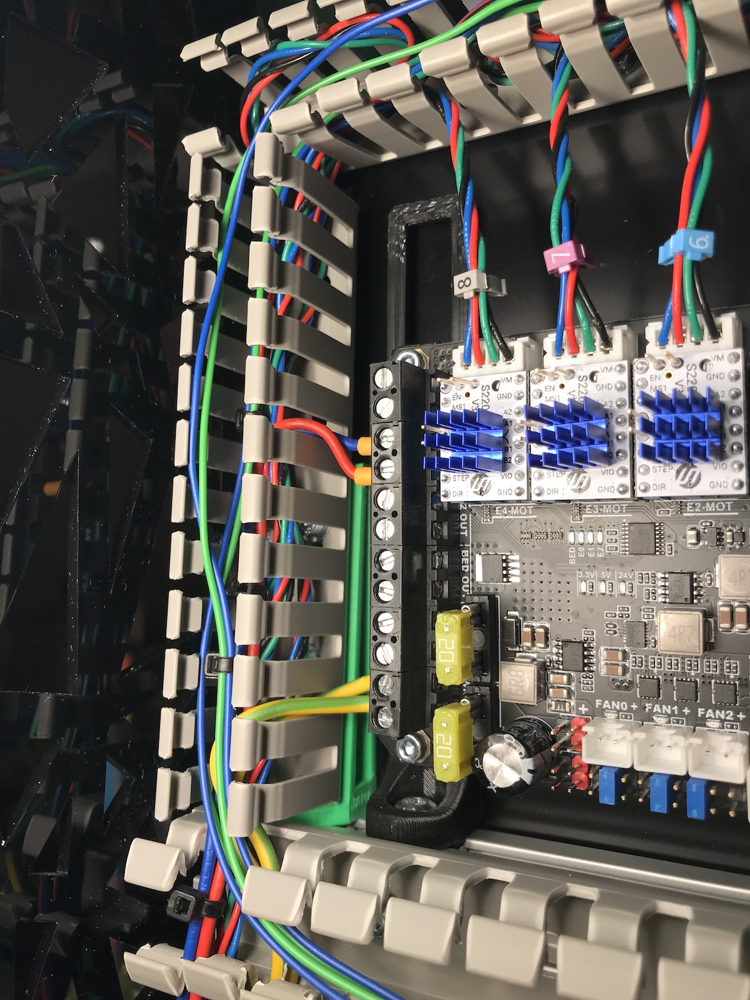

# Wiring Channel Ramp Mount for K3

Allows a piece of wiring channel to be fastened to the top alu extrusion in the backpack, without the need to drill holes.
It also angles the wiring channel to allow for wires to exit the end of the channel butting up against the alu extrusion.
Let me know if the hole pattern works for you.

- I am using 20mmx30mm channel, but 25mmx30-35mm should also work.
- Use the short M3 Heatserts from the K3 BOM
- Use M5x8 BHCS for fastening to the alu extrusion

Ignore the yellow/green wires going in to the spyder :)