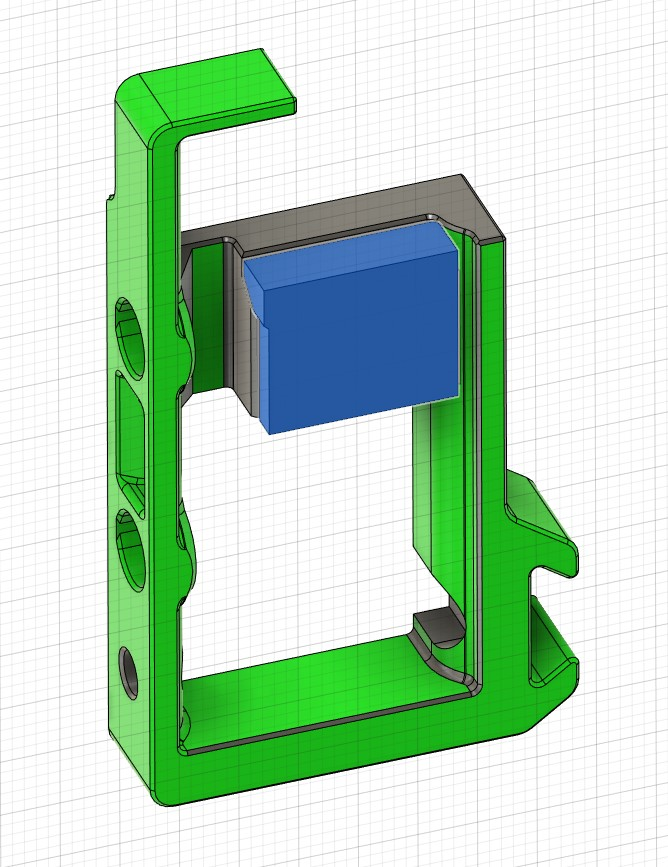
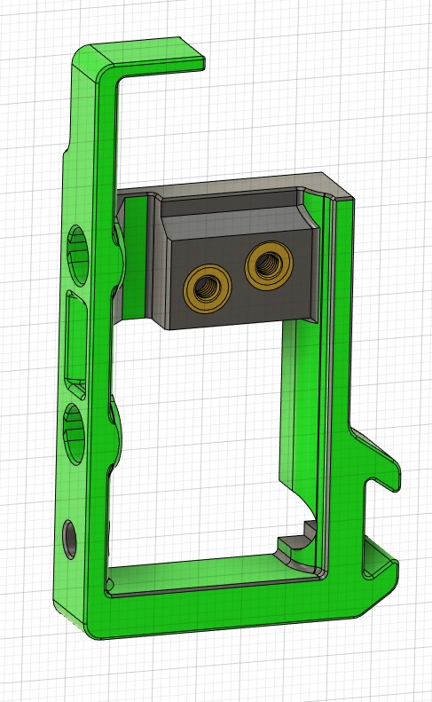

Mod to use nozzle wiper and purge bucket with Beacon probe. You can use the original purge bucket and snip of the tab or print the one without the tab.

# Parts
Print changed files:
- Nozzle_Wiper_Base.stl
- Purge_Bucket.stl
- Nozzle_Wiper_Arm.stl
- Nozzle_Wiper_Bracket.stl

Use original files from K3 repo:
- nozzle_wiper_clamp
- probe_and_wiper_arm

# BOM
You only need
- 2 heat-set inserts (M3x5x4)
- 2 M3x8 SHCS or BHCS

in addition to the screws and heatset-inserts from the K3 BOM.

# Instructions

1) Add heatset inserts into wiper arm according to K3 CAD

2) Remove built-in support in the wiper base

3) Insert two heat-set inserts in the base

4) Attach wiper arm to base 

5) Build remaining parts according to K3 CAD