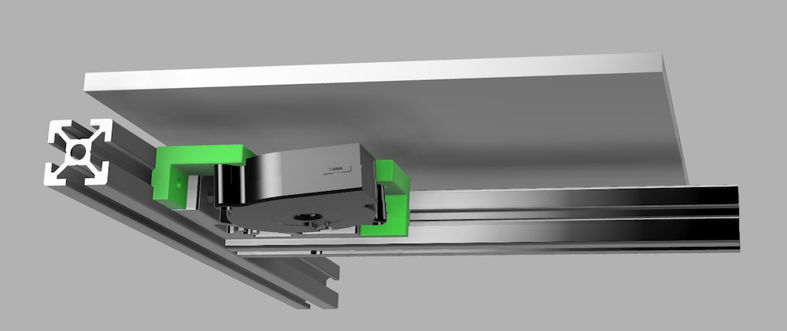

# K3 Under Bed 5015 Fan Mount

This is a very simple mount for an under bed 5015 fan.  I mounted mine on the right since that's where I have room, but you can mirror the parts to mount on the left if that works better for you.

Each part takes one heatset insert that the ear of the fan fits into.  The front part is mounted on the horizontal extrusion in the front of the printer, and has a `F` marked it.  The middle part goes on the middle extrusion that runs front to back and is marked with a `M`.  Each part is intended to be installed snug against the right angle bracket with M3 hardware.  You will need to install the brackets first, then install attach the fan to the brackets.
