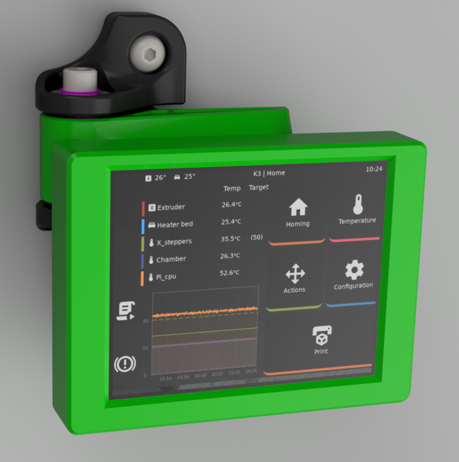
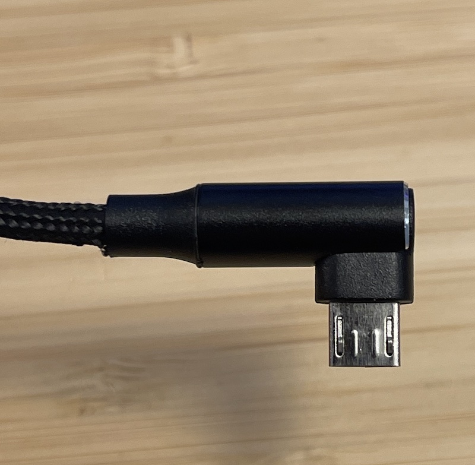
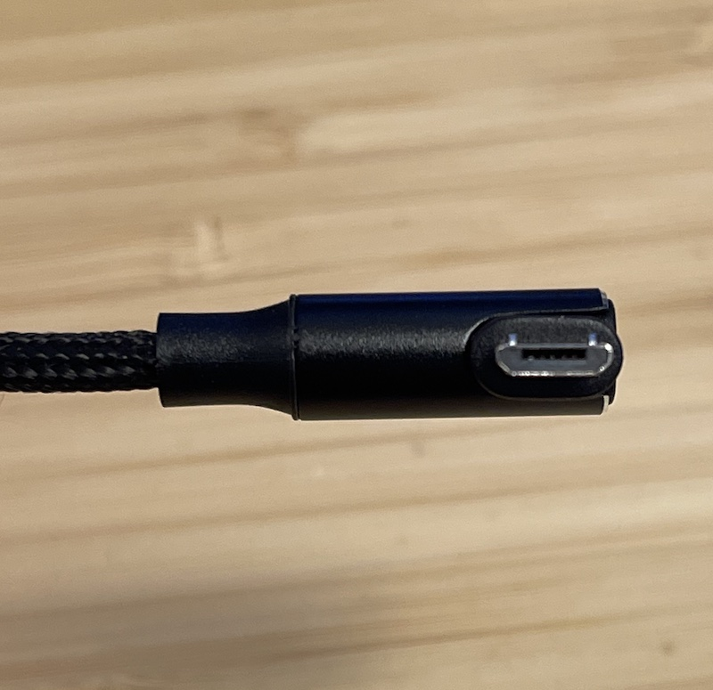
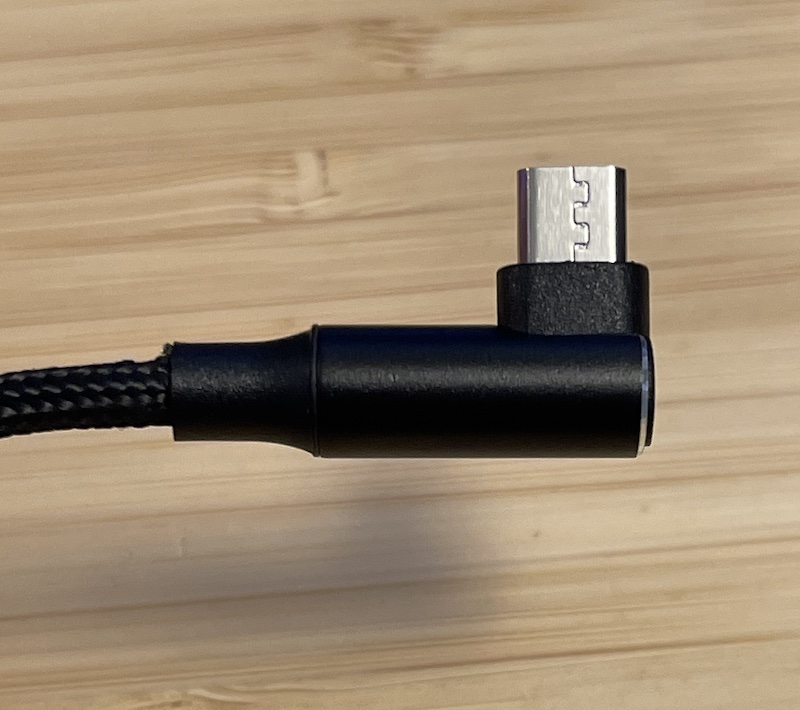

# Door Hinge Mounted KlipperScreen Display

This mod allows you to magnetically attach a 3.5" display to the left door hinges on the K3 and run KlipperScreen on a Raspberry Pi Zero/Zero 2 behind it.  The Raspberry Pi then talks to Moonraker over WiFi and you only need to supply power to the screen.  Since it is magnetically mounted, it's very easy to pop off and hold it or set it on a table, or just remove it entirely if you're going to be working on the printer.



## BOM

- Waveshare 3.5inch Capacitive Touch Screen LCD DPI, IPS
  - [SKU: 19173](https://www.waveshare.com/product/displays/lcd-oled/3.5inch-dpi-lcd.htm)
  - [Waveshare wiki](https://www.waveshare.com/wiki/3.5inch_DPI_LCD)
- Raspberry Pi Zero 2 W
  - Raspberry Pi Zero W will also work, but will be a little sluggish in the UI.
- 8 5mmx4mm M3 brass inserts
- 2 M2.5x6mm or M2.5x8mm screws
- 4 M3x10mm BHCS screws
- 2 M3x8mm BHCS screws
- 12 6x3mm magnets
  - Many cheap 6x3mm magnets are closer to 2.5mm tall.  I designed and tested with the shorter magnets, but ones that are 3mm should work fine.
- Recommended: Pi Zero case
  - Most cases that give full access to the GPIO pins should work.  I used this case https://www.prusaprinters.org/prints/128053-raspberry-pi-zero-case.  You will not have room for a fan or heatsink, but it shouldn't be needed either.
- Recommended: Foam tape
  - This is for the back of the pi case, both to lend some stability and to prevent the case from scratching the door panel.  I used 3mm foam tape with the case above.
- Recommended: Right angle Micro-USB cable (see below)

For the USB cable, you'll need a right angle cable, preferably one that turns towards the left side of the printer.  I found these fairly hard to find.  The able you're looking for should have a connector that looks like this:

Top | Head On | Bottom
:---: | :---: | :---:
 |  | 

The cables that I found that worked can be found on Amazon here:

- [Braided 6 foot cable](https://www.amazon.com/gp/product/B097TB87ZZ)
- [Two sided 6 foot cable](https://www.amazon.com/gp/product/B01COTBHW4)

## Print settings

Normal print settings for the K3 will work fine.  The strength of the magnet pockets is important to not split the parts when installing the magnets.

## Assembly

### 1. Setup Raspberry Pi and KlipperScreen

Attach the Raspberry Pi to the screen and install Raspbian and [install Klipperscreen](https://klipperscreen.readthedocs.io/en/latest/Installation/) on it.  You will need configure KlipperScreen to find your printer by [creating a configuration file](https://klipperscreen.readthedocs.io/en/latest/Configuration/#printer-options).  This config file can be placed in the `pi` user's home directory and should look something like this:

```yaml
[printer K3]
# Define the moonraker host/port if different from 127.0.0.1 and 7125
moonraker_host: k3.local
moonraker_port: 7125
```

Shutdown the Rasperry Pi and remove it from the screen once you've verified it is installed.  Install the Raspberry Pi in the case.

### 2. Install Magnets and Heatset Inserts

In the back case you should install six of the magnets in the large holes.  You should then install six more magnets in the door hinge arm such that they are attracted to the magnets in the back case.  If you get the orientation wrong, you can remove individual magnets by pushing through the holes on the inside of the back case, or by using a small flat screwdriver on the magnets in the door hing arm.

There should be four heat set inserts in the front case, two in the back case on each end of the row of magnets and two in the door hinge arm.

### 3. Install Indexing Screws

Screw two M3x8mm button head screws from the inside of the case into the heatset inserts on each side of the magnets.  These are used to align the and support the case when attached magnetically.

### 4. Assemble Screen

Place the front case face down and place the screen in it.  Be careful of the orientation, the bezel on the bottom of the screen is larger than the other sides, and make sure that matches the front case.

Place the back case on the screen and secure the screen with the M2.5 screws in the two middle holes.  Secure the back case to the front case with the M3 screws.

Install the Raspberry Pi on the back of the case again.

### 5. Replace Hinge

You put the printer together once already, nothing tricky here.  You can replace the top or bottom hinge.  I used the top because my spool holder is mounted at the front bottom of the left side.

### 6. Install Screen

Verify the screen attaches securely to the door hinge arm.  This is a good time to install foam tape to the back to the Raspberry Pi case.  This tape will help stabilize the screen when you're using the screen and keep it from scratching the door panel.

Plug in the USB cable cable to the Raspberry Pi and power it from anything convienent.  Power draw is minimal and powering it off the Raspberry Pi inside the printer will work, or a separate USB power supply.
