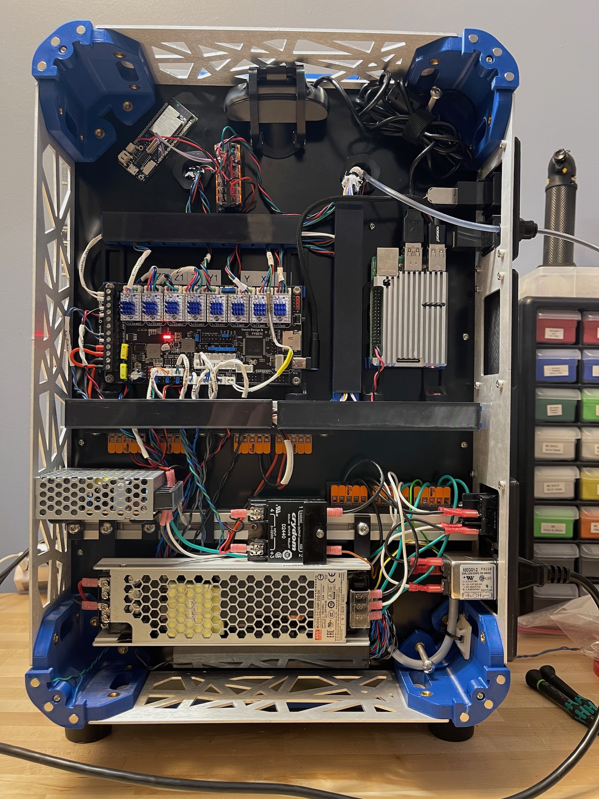
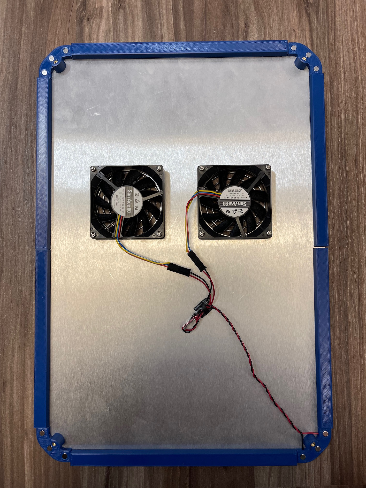

# Magnetic Backpack Cover With Optional Fan Power

This mod allows you to replace the four screws that hold on the backpack cover with a set of magnetic clips in each corner of the backpack.  You can also optionally route power through these magnetic attachment points for the backpack fans so that you do not have to worry about unplugging the fans each time you remove the backpack cover.  This allows you to easily pop off and pop on the cover without having to worry about screws or fan connectors.

Because the magnetic attachments are not integrated in the corners, they do add 9-10mm to the depth of the printer, so if you are space constrainted in that dimension, this may not work well for on.  On the other hand, it also increases the depth of the backpack by 9-10mm, giving you a bit more room to work with.

Because of this extra 9-10mm extra space added, there will be gap between the backpack cover and side panels.  Printable spacers are also included that you can fill this gap.  These are optional, but make it look nicer.

**NOTE:**  It's recommended you do not print the spacers until reading the section below about them.

### Installed pictures

Inside | Backpack Cover
:----: | :------------:
 | 

## BOM

- 12 6mmx3mm magnets
- 4 M3x8 BHCS screws
- 4 M3x6 BHCS or SHCS screws
- 4 M3 5mmx4mm brass inserts

### NOTE

If you are running power through the corner, the dimensions of the magnets is important.  The designed depth of the magnet pockets is 2.75mm, but many cheap "6x3" magnets are closer to 2.5mm tall and they will not allow proper contact for reliable power.

Magnet strength is not especially critical, but if you have them available, using stronger magnets on the corner you run power through may lead to a more reliable connection.

If you are not running power through the corners, then the dimensions are not critical.

## Print settings

Normal print settings for the K3 will work fine, but are probably overkill.  The cover clips and magnetic bases are small parts, and the strength of the magnet pockets is important to not split the parts when installing the magnets.  Feel free to reduce infill/walls/etc on the spacers, since they're purely cosmetic.

## Assembly

### 1. Print parts

Print four of the cover clips and the magnetic base parts.  The cover clips will be attached to the back cover and the magnetic base will attach to the stock backpack corners.

As mentioned above, it's recommended you do not print the spacers now, but wait until you've verified everything is working, since they're large parts.

### 2. Install heat set inserts

Add one heatset insert into each cover clip.

### 3. Install magnets in cover clips and magnetic bases

Install them just like any other magnet in the K3, being careful to make sure the alignment of the magnets is correct.  If you plan to run power through the corners, now is the time to do the wiring.

If you are running power through the corners, you'll need to decide which corner to use.  I used the lower left, but whatever seems like will work best from a wiring standpoint is fine.  The wires are run through the channel and sandwiched between the magnet and plastic similar to the Quickdraw probe.  **NOTE**: As mentioned above, you need to ensure the magnets are not flush or recessed into the plastic if you are running power through the corners, otherwise you will not make a reliable connection.

**NOTE:** If you're reusing existing wiring, make sure it's unplugged from the controller and/or the printer is off.  Don't be dumb like me and forget that 24V power and magnets is a bad combination and short out your fan port.

If the magnets are not snug, you may want to glue them in place, but it's not necessary otherwise.  If you do glue them in, make sure you do not get glue on the surface of the magnets that will carry power.

### 4. Install magnetic bases

Install magnetic bases in the corners of the backpack.  The magnets will be attached to the stock backpack corners with a M3x8mm screw.

A wired magnetic base will look something like this when installed:

### 5. Apply VHB

Apply VHB or some sort of adhesive to the cover clips before installing.  I used 3M VHB 4905 as shown below.  This is needed so that the cover clips will not rotate out of place, since the backpack cover only has a single hole to mount the clip to.  The amount of VHB in the picture below is complete overkill and you can get away with a lot less.

### 6. Install cover clips

Install the cover clips in the backpack cover making sure the outside edge of the clip is well aligned with the backpack cover.  Attache the clips to the backpack cover with a M3x6mm screw.

### 7. Test fit the backpack cover

Making sure the cover is oriented the right way, install the cover and verify the fans come on and stay on if you wired power.  Try jostling the cover around a bit to make sure they're going to stay on.

### 8. Print spacers

You will need two of each spacer.  Note that these pieces are large enough that ABS/ASA shrinkage is a factor.  You may want to scale them up slightly, or set the `Shrinkage` parameter in the slicer settings to compensate.  In SuperSlicer I modified the `Shrinkage` parameter in the filament settings temporarily to be `99.5`.

**NOTE**: You may want to just print one of the side spacer `A` and `B` parts to start with to verify they're the correct size.

### 9. Test fit spacers to make sure they are dimensionally accurate

Place the spacers along the side and top to make sure you're happy with how they fit.  If they're too loose or too tight, adjust the scaling or shrinkage parameter and reprint.

### 10. Install spacers

Apply VHB or some sort of adhesive to the spacers before installing.  I used 3M VHB 4910, but any sort of double sided tape should work.  **NOTE:** It's important to install the VHB on the correct side of the spacer.  Check the diagram below for reference:

