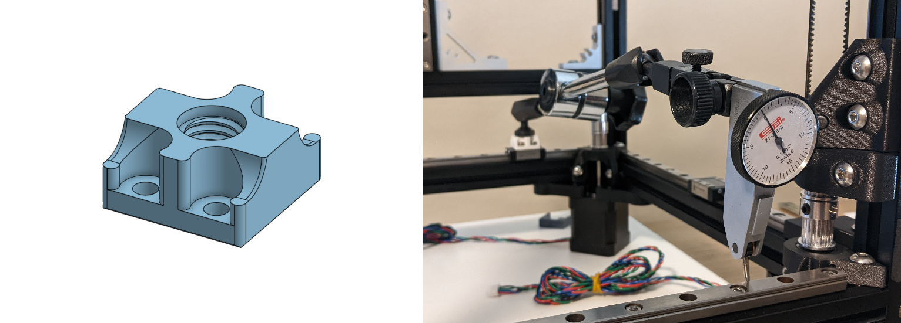
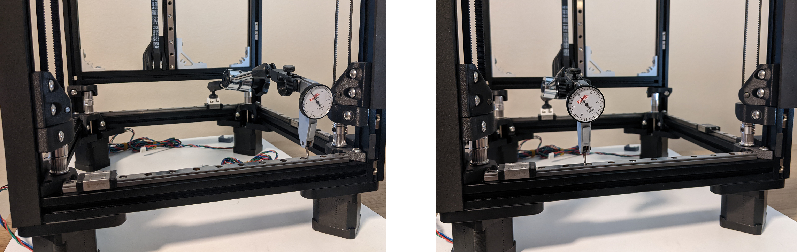
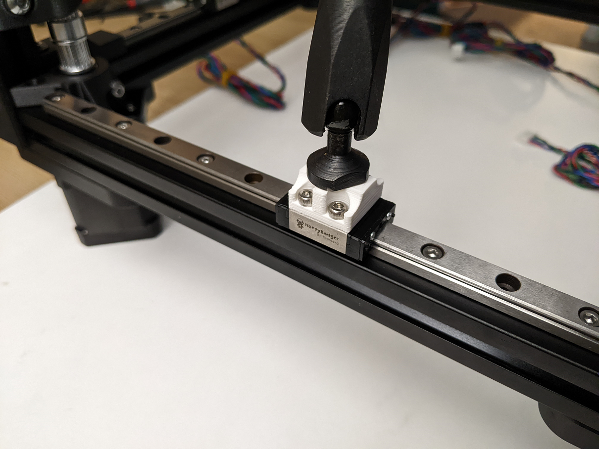

# MGN9C to M8-1.25 Dial Indicator Arm Mount

An adapter to mount a dial indicator arm with a M8-1.25 thread to a MGN9C carriage block. The dial indicator can then be used to accurately align a second rail parallel to the mounted carriage block.

## Alignment Procedure

1. Mount the dial indicator arm to the carriage clock of a reference rail using the printed adapter (see Assembly below).
2. Ensure that the reference rail is properly tightened to your frame.
3. Adjust the indicator arm against the edge of the second rail which you are trying to align. Ensure the indicator arm is fully locked down and stable.
4. Loosen all the bolts on the second rail.
5. Move the dial indicator to one end of the rail and center the rail using a rail centering tool or by eye.
6. Lightly tighten the bolt closest to the dial indicator.
7. Move the dial indicator to the other end and adjust the rail position until the indicated position is the same and tighten the closest bolt slightly.
8. Move back to the first end, loosen the bolt and realign to the same position again.
9. Keep repeating steps 7 and 8 until the indicator position is close enough for your patience.
10. Start tightening other bolts while keeping an eye on the indicator and make adjustments where necessary until the rail is fully tightened.
11. Make a final sweep to verify the rail is parallel and if not, try the steps 4-11 again. Using a dial indicator is an exercise in patience so take your time.

## Assembly
- Insert the four M3 bolts into the printed part.
- Screw the printed part into the M8 thread of the dial indicator arm.
- Using a ball end allen key, screw the four M3 bolts into the carriage block of a mounted rail.

## BOM

| Item                                                             | Qty Required  |
| ---                                                              | ---           |
| M3 x 6mm SHCS                                                    | 4             |
| Dial Indicator Arm with M8 thread                                | 1             |

