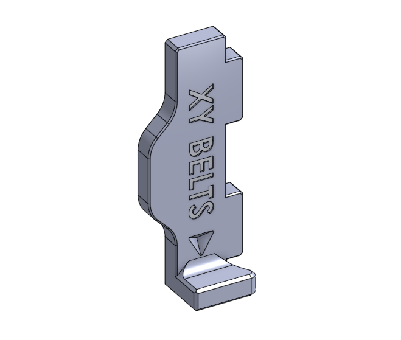
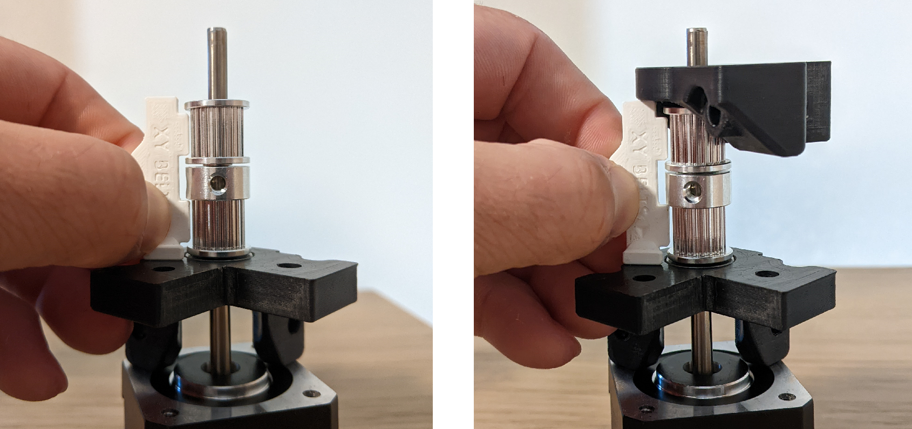
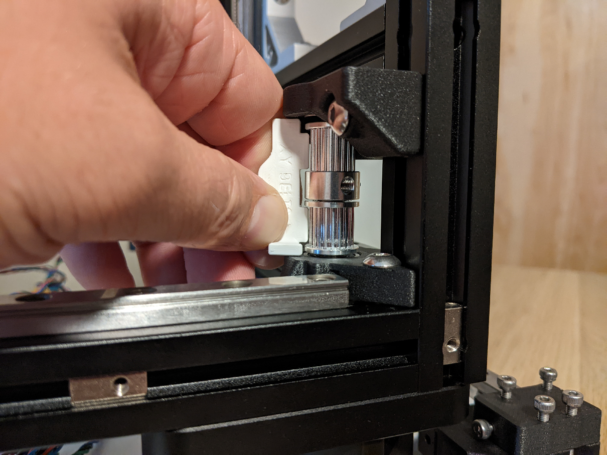

# XY Pulley/Idler Shim Tool

A printed tool to help determine the optimal shim stackup for the K3 XY pulleys and idlers to optimally align to the belts. The shim configuration on the K3 GitHub assumes specific dimensions for the pulleys and idlers which may not be the same between brands. Using this tool will make it easier to determine the shims for other pulley and idler dimensions.

## Notes

The alignment tool has four alignment features
- The bottom surface (which is indicated by the arrow) should be up against the printed bearing mount closest to the motor.
- The top surface (opposite the arrow) should be aligned with the printed bearing mount furthest from the motor.
- The two tabs are 9.5mm wide and are positioned where the belts will intersect the pulleys and idlers. The extra 0.25mm on each side of the tab is to help with clearance for a 9mm belt.

## Procedure

There are two possible pulley and idler orientations, one with the pulley closest to the motor and one with the idler closest to the motor. You will need to determine the shim stackup for each configuration. See [XY Shim Placement](https://github.com/Annex-Engineering/Gasherbrum-K3/tree/main/Release_1_2/STLs/XY_Gantry) for a more detailed reference. In general the pulley will always have the grub screw side up against the idler.

For pulley closest to motor:

1. With the motor on the table with the shaft pointing up, place the upper bearing mount onto the shaft as it would be oriented relative to the motor on the printer.
2. Place shims and then the pulley with the grub screw side pointing up.
3. Check the position of the pulley with the tool by placing the side indicated by the arrow up against the bearing mount and checking for belt clearance on the pulley with the bottom tab of the tool. Make any adjustments needed to the bottom shim stack.
4. Now place more shims onto the pulley and then place the idler, check the clearance of both the pulley and idler with the tool. You may have to adjust the bottom and middle shim stacks.
5. Once both the pulley and idler have decent clearance based on the tool, apply shims to the top of the idler and place the other bearing mount on top (making sure to user the correct orientation relative to the motor)
6. If the top of the tool is flush with the printed bearing mount then the stackup is done, otherwise make adjustments to the top shims.

Make note of the shims used from the motor side out and then do the same for the idler closest to the motor and pulley on top (with grub screw side down instead). These will be the shims used when assembling on the printer.

## Images

Using the tool to verify final pulley and idler stackup on the printer

