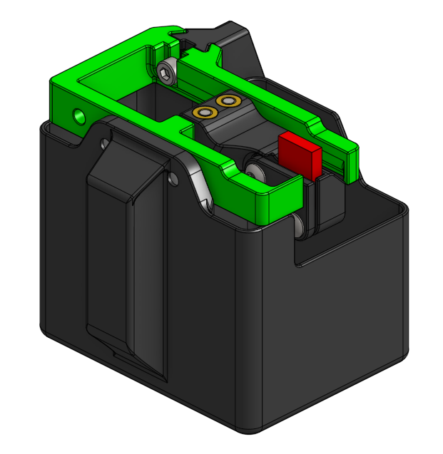

# Nozzle Wiper and Purge Bucket for Beacon

Modifications to the stock K3 nozzle wiper and purge bucket parts to remove interferences that would colide with the Beacon. The current version of this modification opts for a fixed wiper for simplicity and should work for both RevD and RevH Beacons according to CAD, but has only been tested with RevD. Inspired by the nozzle wiper user modification from [chkockle](https://github.com/Annex-Engineering/Annex-Engineering_User_Mods/tree/main/Printers/K3/chkockle-Nozzle_Wiper_Beacon).

The nozzle_wiper_clamp printed part from the stock wiper is unchanged and can be found [here](https://github.com/Annex-Engineering/Gasherbrum-K3/tree/main/Release_1_2/STLs/Probe_Dock_and_Purge_Bucket). The stock purge_bucket can be reused if the "tab" on the top is cut off.

## Goals
- Try to maintain stock aesthetics
- Removes any geometries that would interfere with the Beacon probe
- Support-free printing

## Shortcomings of Current Version
- Finicky to adjust height
- No "spring-loaded" wipe action

## BOM
- Sources for all items can be found in the Annex [sourcing guide](https://docs.google.com/spreadsheets/d/1O3eyVuQ6M4F03MJSDs4Z71_XyNjXL5HFTZr1jsaAtRc/htmlview#) for the K3.

| Item                                                             | Qty Required  |
| ---                                                              | ---           |
| M3 x 5mm Dia x 4mm Length Heat Set Insert                        | 5             |
| M3 x 4mm SHCS or BHCS                                            | 5             |
| 6x3mm Magnet                                                     | 4             |
| Silicone 14+ mm Length                                           | 1             |

## Assembly
- Install 1x M3 Heat Set Inserts in the nozzle_wiper_bracket and 4x in the nozzle_wiper_arm.
- Clamp a silicone strip between the nozzle_wiper_arm and nozzle_wiper_clamp with 2x M3 screws
- Attach the nozzle_wiper_arm to the nozzle_wiper_base with 2x M3 screws from the bottom.
- Attach the nozzle_wiper_base to the nozzle_wiper_bracket with a M3 screw using the access hole in the side of the base.