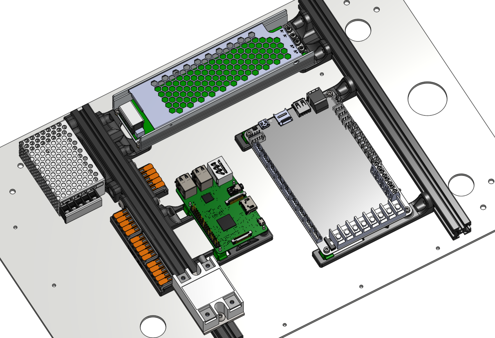

# Modified eBox Brackets

Annex electronic box brackets for a simplified layout that focuses on easy assembly and access, spreading out the components to make use of the full electronic box size. The power supply bracket is highly specialized and only works with a 200W UHP Meanwell power supply.

## Notes

- The Meanwell UHP 200 power supply brackets have been designed to allow the power supply to be installed vertically between the two 2020 extrusions.
- The Raspberry Pi bracket pushes the M5 bolt holes outwards to allow easier installation.
- The controller bracket has been extended to allow access to the panel bolts that were normally hidden behind the controller.
- The controller and Pi brackets are 6mm thick instead of 5mm to give added rigidity.
- The Meanwell RS-5-25 power supply bracket is based off of the v1.2 CAD bracket and allows the power supply to sit lower, while giving clearance for an SSR to also be installed next to the power supply if desired.
- Added extrusion locating features to most brackets.
- Raised all brackets (except for the Wago mounts) up 0.5mm off of the back panel to allow some clearance for 1mm foam tape to dampen vibrations of the brackets.
- Narrower Wago mounts that support one, two, or three of the 5 conductor 221-415 Wago splicing connector.

## BOM

- Sources for all items can be found in the Annex [sourcing guide](https://docs.google.com/spreadsheets/d/1O3eyVuQ6M4F03MJSDs4Z71_XyNjXL5HFTZr1jsaAtRc/htmlview#) for the K3.

| Item                                                             | Qty Required  |
| ---                                                              | ---           |
| M3 x 5mm Dia x 4mm Length Heat Set Insert                        | 4             |
| M3 x 5mm Dia x 6mm Length Heat Set Insert                        | 4             |
| M5 x 8mm SHCS or BHCS                                            | 10            |
| M5 x 10mm SHCS or BHCS                                           | 4             |
| M3 x 6mm SHCS                                                    | 6             |
| M2.5 x 10 SHCS                                                   | 4             |
| 1mm Thick x 5mm or 8mm Wide Foam Tape	                           | 300 mm        |

## Print Settings

- Nozzle Size: 0.4mm or 0.5mm
- Material: ABS or ASA
- Layer Height: 0.2mm
- Infill Percentage: 40%
- Wall Count: 4
- Solid Top/Bottom Layers: 5

Print with imported orientation and no shrink compensation for ABS or ASA.