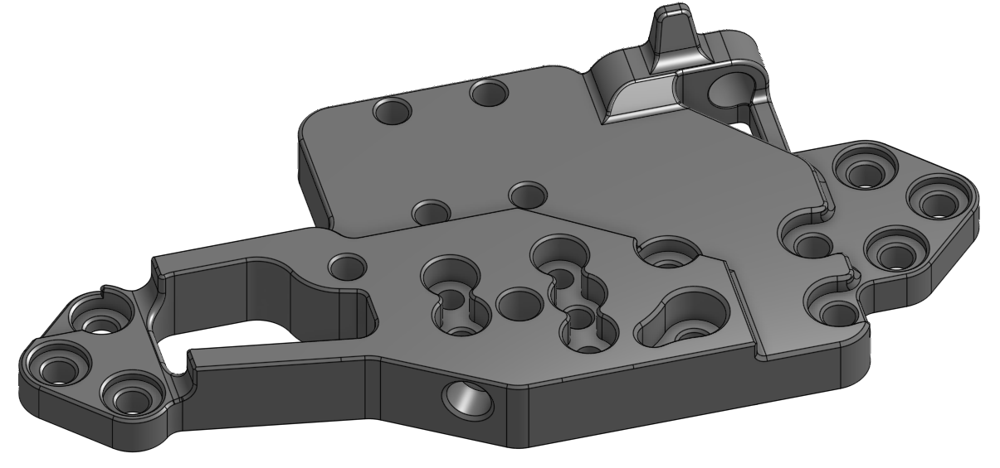

# Fixed K3rabiner Sherpa Micro Mosquito/Dragon Plate

The new K3rabiner compatible carriage plate that supports the Sherpa Micro extruder has several issues that this fixed version fixes. Also included is a slightly modified mirrored Sherp Micro front plate to match the fixed plate.

- Addes a chamfer to the Sherpa Micro heat set hole so the countersunk hole can be correctly printed with FDM.
- Increases the thickness of the wall next to the counter-sunk hole to improve printability with 0.4 mm or 0.5 mm nozzles.
- Changes the angle of the face that attaches to the Sherpa Micro front plate to correctly align with the Sherpa Micro since the K3rabiner changed the angle of the extruder on the plate from 35 degrees to 32 degrees.

| Fixed | Stock |
| --- | --- |
|  |  |
|  |  |
|  |  |

## Printing Notes
- Due to the importance of z dimensions on the printed carriage on the K3, this part (or the stock plate) should be printed with a 0.3mm first layer and 0.2 mm subsequent layers so that height between the two rail carriage mounting surfaces is exactly 6.5mm.

## BOM

- No hardware changes from the stock part.

## Print Settings

- Nozzle Size: 0.4mm or 0.5mm
- Material: ASA or PC-CF
- Layer Height: 0.2mm (with 0.3mm first layer)
- Infill Percentage: 40%
- Wall Count: 4
- Solid Top/Bottom Layers: 5

Print with imported orientation and no shrink compensation for ASA or PC-CF.