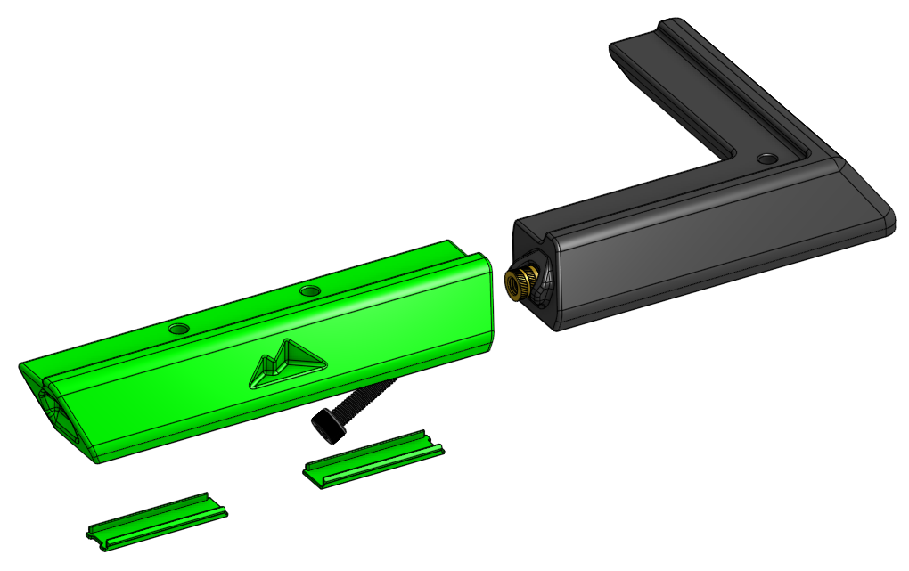
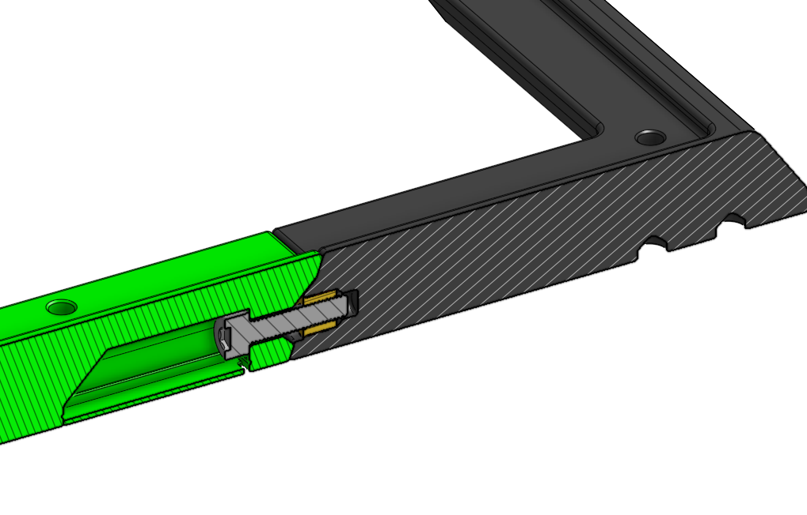
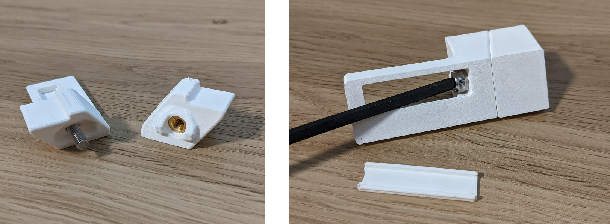

# M5-Based Tophat

This mod allows assembly of the K3 tophat using M5 bolts and heat set inserts instead of printed dowels and glue. The design is inspired by [yhaiovyi's tophat](https://github.com/everycoloryouare/Annex-Engineering_User_Mods/tree/main/Printers/K3/yhaiovyi-K3_Glueless_Tophat) mod, but keeps the original K3 design asthetic.

## Goals
- Allow for easy assembly and disassembly
- Improve rigidity
- Maintain original design asthetic

## BOM
- Sources for all items can be found in the Annex [sourcing guide](https://docs.google.com/spreadsheets/d/1O3eyVuQ6M4F03MJSDs4Z71_XyNjXL5HFTZr1jsaAtRc/htmlview#) for the K3.

| Item                                                             | Qty Required  |
| ---                                                              | ---           |
| M5 x 8mm Dia x 7mm Length Heat Set Insert   M5 x 7.5mm Dia x 7mm Length (Fabreeko)                        | 8             |
| M5 x 20mm SHCS or BHCS                                           | 8             |
| M3 x 5mm Dia x 4mm Length Heat Set Insert                        | 12            |
| 6x3mm Magnet                                                     | 12            |

## Beta and Test Prints
This mod is currently in beta and has not been fully tested with different printer tolerances or material types. If you are curious how parts will fit but don't want to waste filament on the full parts, there are test parts you can print in the <i>STLs/test_prints/</i> folder to check fitment.

Feel free to tag @EveryColorYouAre on the Annex Engineering discord if you have questions or feedback.

## Assembly
- Insert M3 heat set inserts and magnets into the printed parts as for the stock tophat.
- Insert two M5 heat set inserts into the ends of each tophat corner (tophat_lid_structure_a_x4_rev1).
- Push two M5 x 20mm bolts into the slot and through the hole in each tophat center ([a]_tophat_lid_structure_b_x4_rev1) and screw into the heat set of the tophat corners using a ball end allen key.
- Two optional covers can be snapped into the bolt slots of each tophat center.

## Notes
- The Fabreeko kit comes with slightly smaller heat set inserts measuring 7.5mm in diameter instead of 8mm. If you are using these inserts then print the corner parts (tophat_lid_structure_a_fabreeko_x4_rev1) in the <i>STLs/for_frabreeko_heat_set/</i> folder instead.
- These parts are not compensated for material shrinkage. Please scale your parts in x and y to account for any material shrinkage or else the top panel holes may not line up corretly. A 0.5-1.0% shrinkage will cause the corner bolt holes (which are seperated by 280mm) to be off by 1.4-2.8mm. 

## Images
Cross-section of assembled tophat

Test print parts assembled
