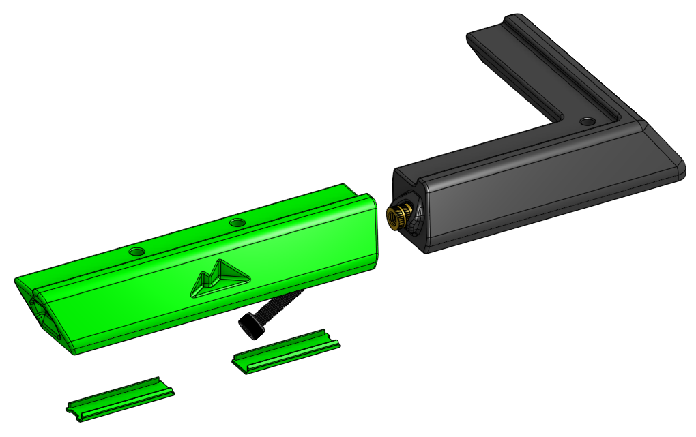
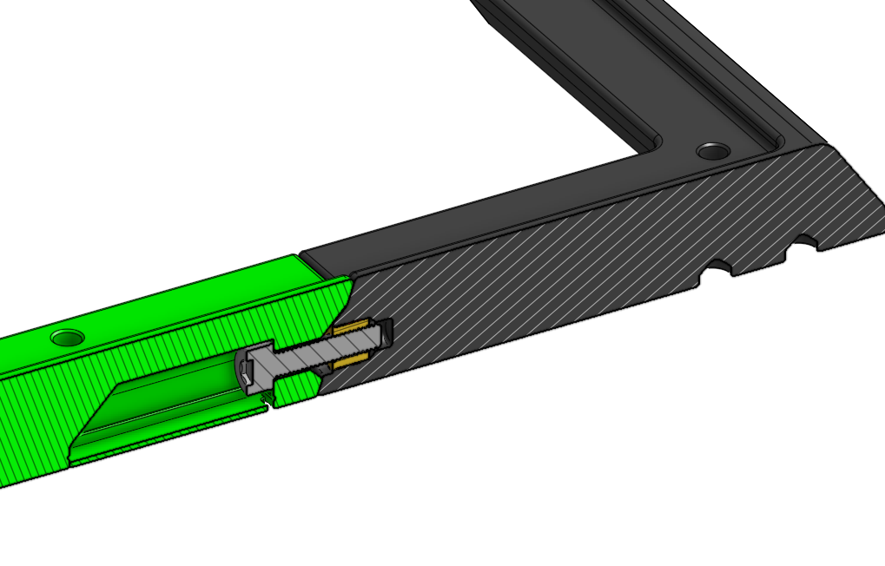
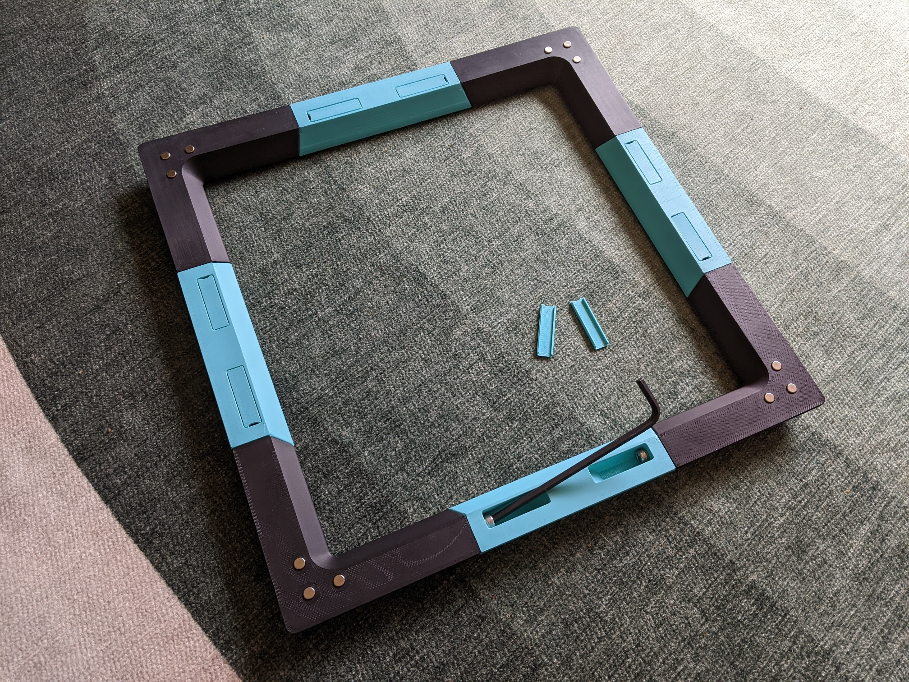
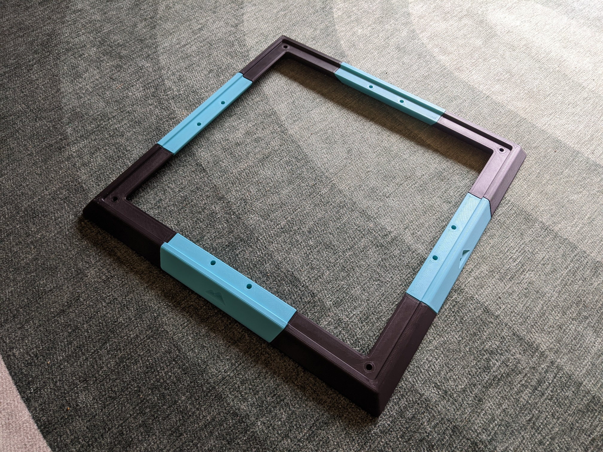
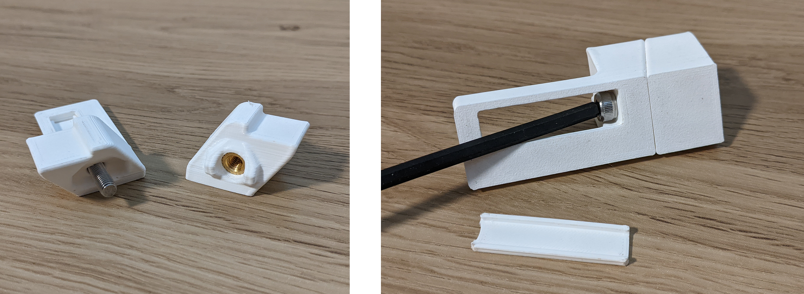

# M5-Based Tophat

This modification allows assembly of the K3 tophat using M5 bolts and heat set inserts or nuts instead of printed dowels and glue. The design is inspired by [yhaiovyi's tophat mod](https://github.com/Annex-Engineering/Annex-Engineering_User_Mods/tree/main/Printers/K3/yhaiovyi-K3_Glueless_Tophat), but keeps the original K3 design aesthetic. Thanks to Exsencer for suggesting the M5 nut version.

Feel free to tag @EveryColorYouAre on the Annex Engineering discord if you have questions or feedback.

## Goals

- Allow for easy assembly and disassembly
- Improved rigidity
- Maintain original design aesthetic

## Important Printing Notes

- There are two versions of the corner pieces which use either M5 8mm Dia x 7mm Length Heat Set Inserts found in the K3 BOM, or regular M5 Nuts. The STLs are separated into folders by fastener type.
- The printed pieces are large and fit together tightly and are therefore sensitive to material shrinkage. A 0.5-1.0% shrinkage will cause the corner bolt holes (which are separated by 280mm on a side) to be off by 1.4-2.8mm and the top panel will not line up correctly.
- The STL files are pre-compensated for 0.5% shrinkage which should be good for ABS or ASA. For different shrink amounts, instead print the uncompensated .step files and scale them appropriately.

## BOM

- Sources for all items can be found in the Annex [sourcing guide](https://docs.google.com/spreadsheets/d/1O3eyVuQ6M4F03MJSDs4Z71_XyNjXL5HFTZr1jsaAtRc/htmlview#) for the K3.

| Item                                                             | Qty Required  |
| ---                                                              | ---           |
| M5 x 8mm Dia x 7mm Length Heat Set Insert   or M5 Nut         | 8             |
| M5 x 20mm SHCS or BHCS                                           | 8             |
| M3 x 5mm Dia x 4mm Length Heat Set Insert                        | 12            |
| 6x3mm Magnet                                                     | 12            |

## Assembly

- Insert M3 heat set inserts and magnets into the printed parts as for the stock tophat.
- Insert two M5 heat set inserts or M5 nuts into the ends of each tophat corner.
- Push two M5 x 20mm bolts into the slot and through the hole in each tophat center and screw into the heat set or nut of the tophat corners using a ball end allen key/driver.
- Two optional covers can be snapped into the bolt slots of each tophat center for a cleaner look.

## Images

Cross-section of assembled tophat

Completed Assembly

## Tolerance Test Prints

This mod has not been fully tested with different printer tolerances or material types. If you are curious how parts will fit but don't want to waste filament on the full parts, there are test parts you can print in the <i>STLs/test_prints/</i> folder to check fitment.

## Print Settings

- Nozzle Size: 0.4mm or 0.5mm
- Material: ABS or ASA
- Layer Height: 0.2mm
- Infill Percentage: 40%
- Wall Count: 4
- Solid Top/Bottom Layers: 5

Print with imported orientation and no shrink compensation for ABS or ASA.

## Change Log

- rev2: Increased radius on corners of the covers and cover holes on the center pieces, increased tolerance gap from 0.1 to 0.15mm. Slightly changed shape of corner matting surface for better matching to center piece.
