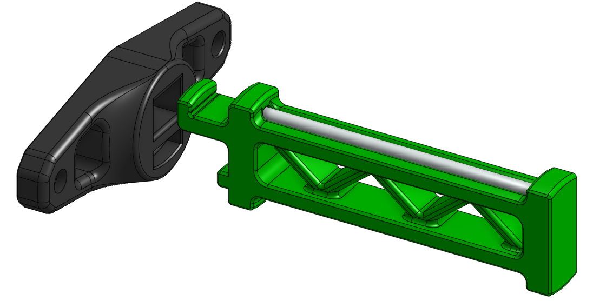

# Detachable K3 Spool Holder

A better spool holder for the K3 that uses a PTFE tube as a bearing surface and can be detached easily when it is not in use. The design is heavily based on the [Voron Switchwire spool holder](https://github.com/VoronDesign/Voron-Switchwire/tree/master/STL) with the base modified to mount to the side of the K3, and some tweaks to the locking mechanism and styling.

## Notes

The spool holder base has a section that requires a decently large section of bridging. If your bridge settings are not dialed the locking mechanism might be overly tight but will probably break in over time.

## BOM

- Sources for all items can be found in the Annex [sourcing guide](https://docs.google.com/spreadsheets/d/1O3eyVuQ6M4F03MJSDs4Z71_XyNjXL5HFTZr1jsaAtRc/htmlview#) for the K3.

| Item                                                             | Qty Required  |
| ---                                                              | ---           |
| 4mm OD PTFE, 80-85mm in Length                                   | 1             |
| M3 x 16mm SHCS                                                   | 2             |

Mounting the spool holder with two 16mm SHCS should work for 2mm or 3mm panels with 3mm panel spacers. If both panels and panel spacers are 2mm thick then 16mm screws might be too long depending on extrusion manufacturer.

## Print Settings

- Nozzle Size: 0.4mm or 0.5mm
- Material: ABS or ASA
- Layer Height: 0.2mm
- Infill Percentage: 40%
- Wall Count: 4
- Solid Top/Bottom Layers: 5

Print with imported orientation and no shrink compensation for ABS or ASA.