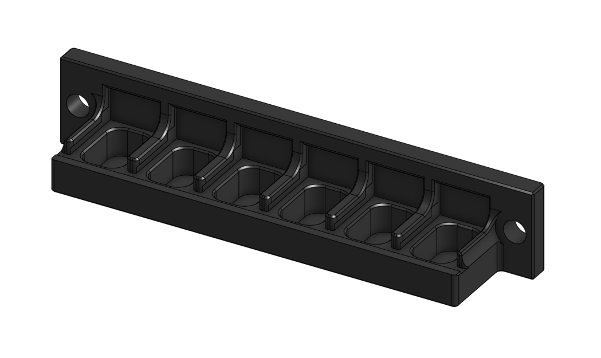
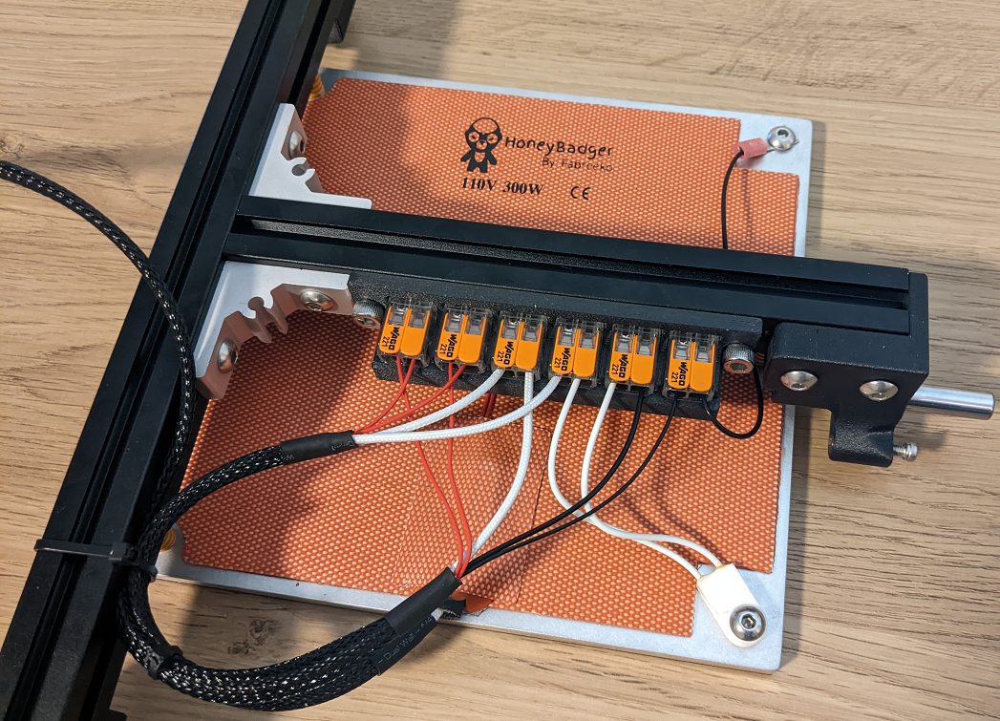

# Wago 221-412 x6 Bed Mount

A mount for six of the 2-conductor Wago mounts (221-412) for connecting the bed AC, thermistor, thermal fuse, and grounding wire to the backpack. It is based on the Annex Engineering Wago mounts and modified for 2-conductor Wagos. The bolt holes and edges were adjusted so that it fits under the K3 bed between the corner bracket and the rear bed mount. A thin solid layer was added to the bottom to provide some radiant heat insulation to the Wagos.

## Goals

- Allow for easy bed wiring, modifications, and disassembly
- Keep all Wagos accessible and oriented the same direction

## BOM

| Item                                                             | Qty Required  |
| ---                                                              | ---           |
| Wago 221-412                                                     | 6             |
| M5 x 10mm SHCS (not BHCS)                                        | 2             |

## Notes

- The bed has moving AC wires, so ensure all wires are properly strain relieved and that the bed is properly grounded.
- Print out of a heat resistant material like PC.
- Only fits with the small Misumi corner brackets, the large corner brackets are too big.

## Print Settings

- Nozzle Size: 0.4mm or 0.5mm
- Material: ASA or PC-CF
- Layer Height: 0.2mm
- Infill Percentage: 40%
- Wall Count: 4
- Solid Top/Bottom Layers: 5

Print with imported orientation and no shrink compensation for ASA or PC-CF.