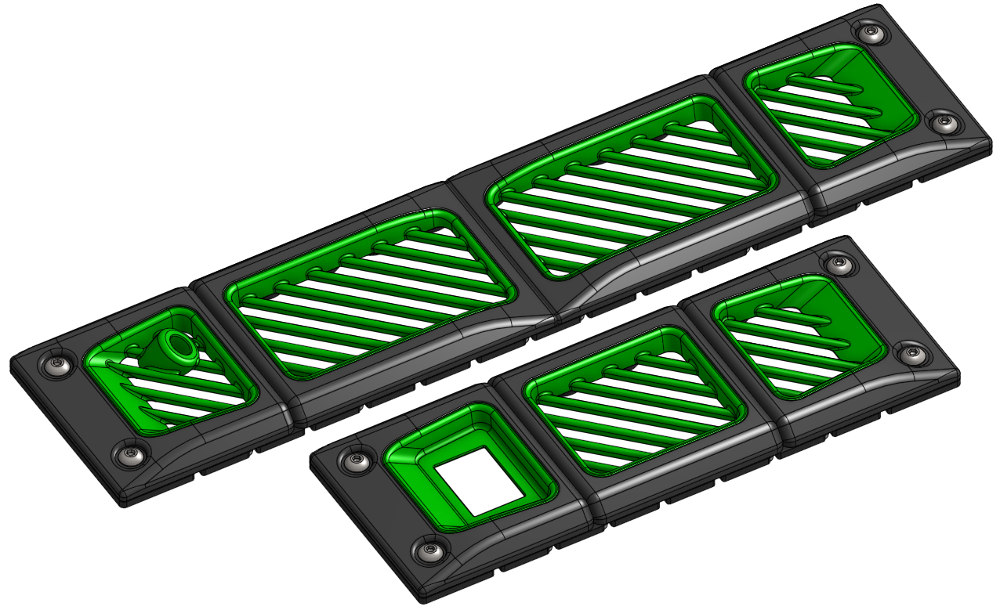

# Dual Color eBox Panels

Annex electronic box panels based on [Karabox's eBox mod](https://github.com/karabox/MISC/tree/main/Annex%20Mods/K3%20eBox%20mod) which splits the default panels into two parts such that inserts can be printed in a different color to give a dual tone aesthetic. This modification is a complete redesign that keeps the dual tone look but remodels the default panels to be 5mm thinner so the overall electronic box is less bulky.

## Notes

- There are two different inserts for bowden couplers, one with a centered inlet angled down and one with an off-center inlet angled down and to the side.
- For each base panel, there are three versions with 0.05mm, 0.1mm, and 0.2mm clearances for inserts. Depending on printer tolerances and the clearance chosen the insert will either need to be glued or press fit.
- Also included are redesigned cover panel handles that are 5mm thinner and have the Annex mountain styling.
- The pneumatic bowden fitting is screwed directly into the plastic. The hole might need to be drilled out or tapped depending on the exact fitting used.

## BOM
- Sources for all items can be found in the Annex [sourcing guide](https://docs.google.com/spreadsheets/d/1O3eyVuQ6M4F03MJSDs4Z71_XyNjXL5HFTZr1jsaAtRc/htmlview#) for the K3.

| Item                                                             | Qty Required  |
| ---                                                              | ---           |
| M3 x 5mm Dia x 4mm Length Heat Set Insert                        | 40            |
| M5 x 16mm BHCS                                                   | 16            |
| M3 x 8mm SHCS                                                    | 28            |
| M3 x 6mm SHCS                                                    | 4             |
| M3 x 22mm SHCS                                                   | 8             |
| M10 Pneumatic Bowden Fittings (Optional)                         | 1             |

Bolt lengths assume 2mm electronic box panels and two 8015 axial fans are used. Washers on the M3 screws are recommended.
