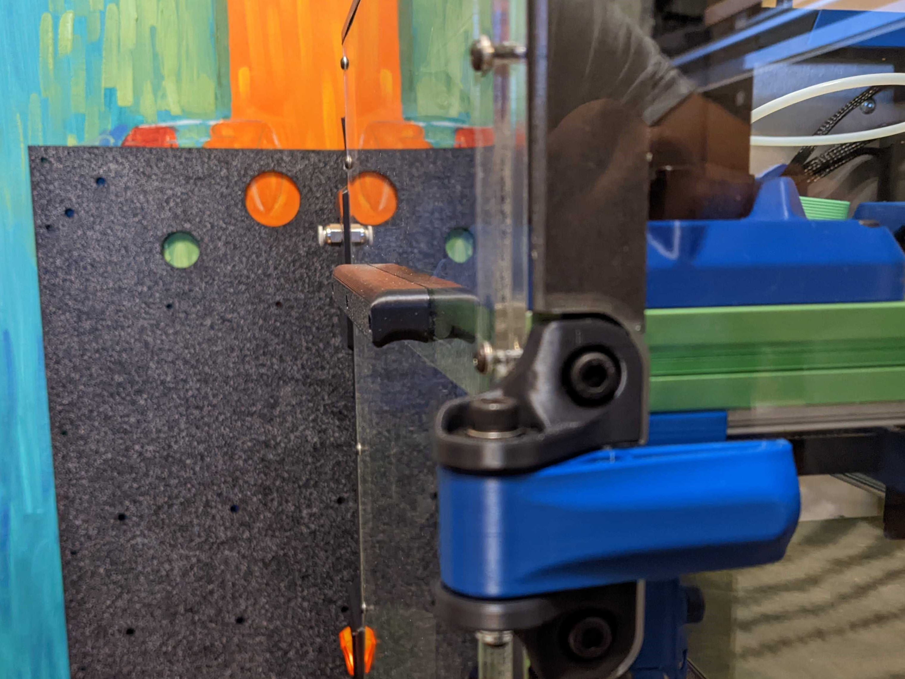
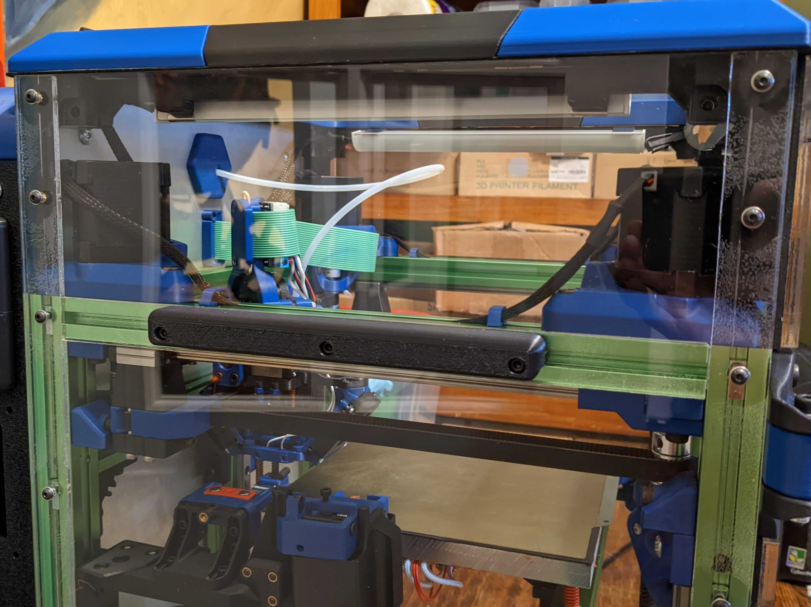

**Minimalist Handles**
============
<table width=100%>
<TR><TD width=50% align="center"></TD>
<TD width=50% align="center"></TD>
</TR>
</TABLE>

- Notes
   - Some small handles that are strong.  
   - These handles only protrude 15 mm
- Printing
	 - I have 3mm panels and 3mm spacers and used m3x20 mm bolts.
	 - Make sure to be aware of your material shrinkage. The bolt holes are slotted a little bit to compensate a little bit.  
	 -  I usually scale my larger ABS parts that need to line up with bolt holes to 100.58% in X and Y.
