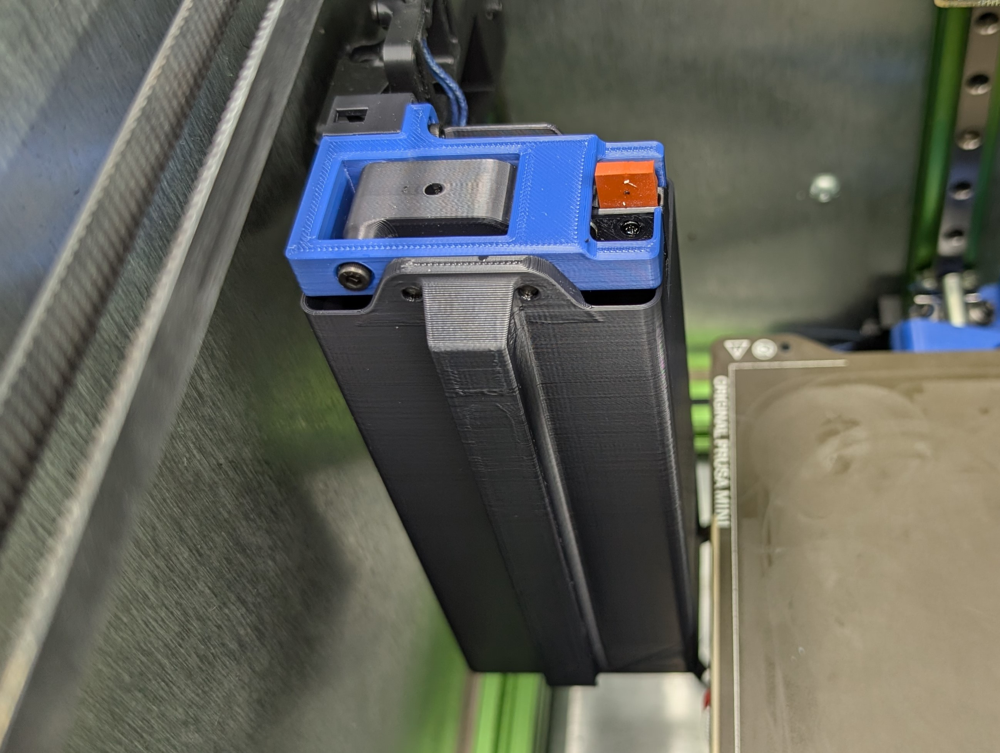
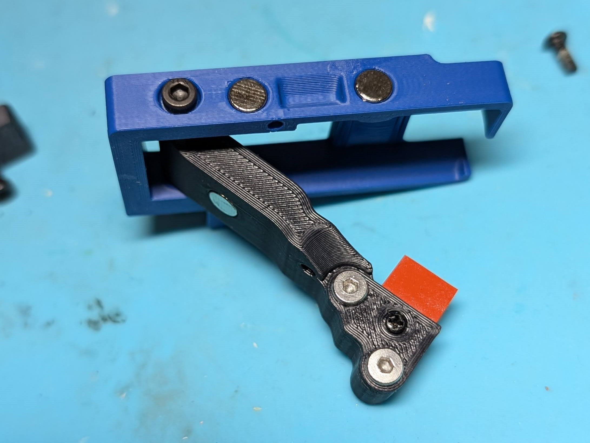
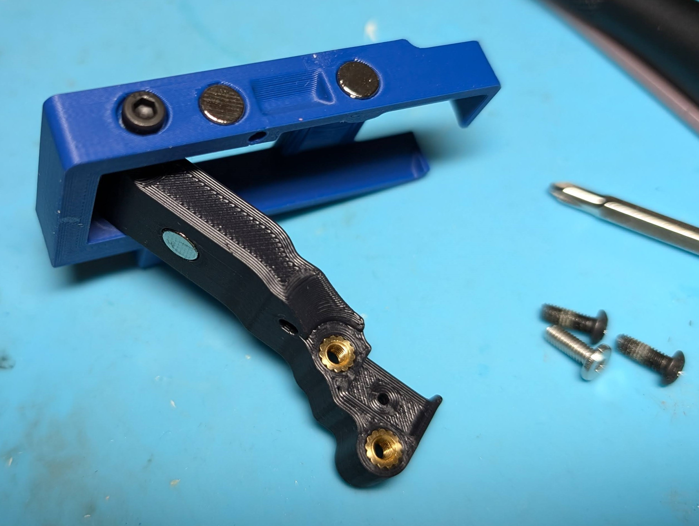
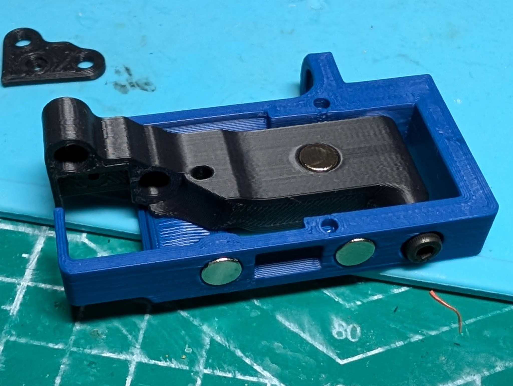

**K3 Nozzle Wiper - Beacon Compatible, Magnetic Arm**
============

*click for video of the wiper in action*
  
  
<table width=100%>
<TR>
<TD width=50% align="center"></TD>
<TD width=50% align="center"></TD>
</TR>
<TR>
<TD width=50% align="center"></TD>
<TD width=50% align="center"></TD>
</TR>
<TR>
<TD width=50% align="center"></TD>
<TD width=50% align="center"></TD>
</TR>
<TR>
<TD width=50% align="center"> This is bottom of the lower magnet mount.  This magnet attaches to the purge bucket.</TD>
<TD width=50% align="center"> The m3x8 acts as the wiper arm down stop.  This magnet opposes the magnet in the wiper arm.</TD>
</TR>
<TR>
<TD width=50% align="center"></TD>
<TD width=50% align="center">&nbsp;</TD>
</TR>
</TABLE>

**Notes**
   - This is a mod of the K3 nozzle wiper which adds compatability with the beacon probe.
     - Uses opposing magnets on the wiper arm so the wiper can move up and down again
       - Has adjustable arm stops to limit motion of the arm in the up and down directions.
       - I mainly use the down stop so that the wiper stops just higher than the nozzle tip for a firm wipe.
     - Changes the mounting of the frame to be more rigid
     - Lengthens the purge bucket and adds a 3rd magnet to the bucket to increase stability of the bucket.
     - Adds an m2 screw to hold the wiper in place

**BOM**
   - (8) 6mm x 3mm magnets
   - (4) m3 x 5mm x 4mm heat sets
   - (5) m3 x 8mm screws (i use two pan heads or button heads instead of SHCS on the wiper arm to hold the silicone)
   - (1) m3 x 10-12mm bolt (optional, for if you need the arm up-stop.  I didn't use this)
   - (1) m3 x 30mm bolts
   - (1) m3 nylock nut
   - Silicone 10mm x ~14.5mm x 3mm thick for the nozzle wiper (from K3 BOM)

**Build Instructions**
   - Print the STLs in the provided orientation
   - Assemble the [Wiper Arm]
     - Use two m3 heat sets, two m3x8 bolts (preferrably low profile head), one m2 self tapping screw, silicone from BOM, and one 6mm x 3mm magnet (no glue required for this magnet since it is in opposition).
     - If you need to restrict the upward motion of the arm, then add a m3x10 or 12 up through the hole on the underside of the arm
   - Assemble the [Nozzle Wiper Base]
     - Insert a m3 heatset into the right back side of the frame (behind where the mount slot is.
     - Insert a m3 nylock nut into the hexagonal hole
     - Attach the wiper arm with a m3x30 bolt into the nylock nut.  Leave this bolt somehwat loose so the arm can move freely.
     - Insert two 6mm x 3mm magnets into the side, noting the oriention so they will attract the [Purge Bucket]
   - Assemble the [Lower Magnet Mount]
     - Insert a 6mm x 3mm magnet into the angled hole on the upper side of the part (makes sure the orientation opposes the magnet in the [Wiper Arm].  
     - Insert a m3x8 up through the hole on the underside of the [Lower Magnet Mount].  *This is the arm down stop*.  
       - ***Adjust this so that it restricts the wiper arm to just above the level of the nozzle tip.***  This helps give the nozzle tip a firm wipe.
     - Insert a 6mm x 3mm magnet into the underside, noting orientation for the purge bucket.
     - Glue the [Lower Magnet Mount] to the [Nozzle Wiper Base].  
   - Assemble the [Purge Bucket]
     - Insert three 6mm x 3mm magnets into the bucket noting the orientation to attract the two magnets in the [Nozzle Wiper Base] and the magnet in the [Lower Magnet Mount]

