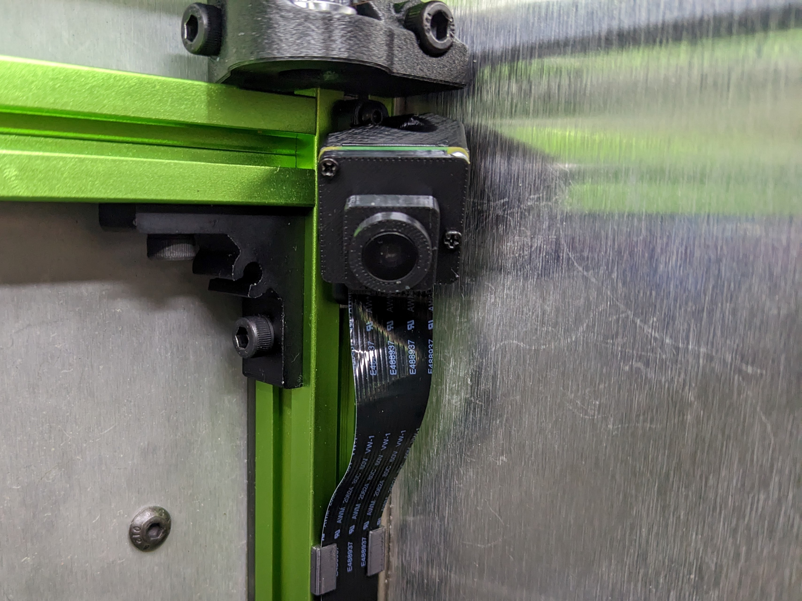
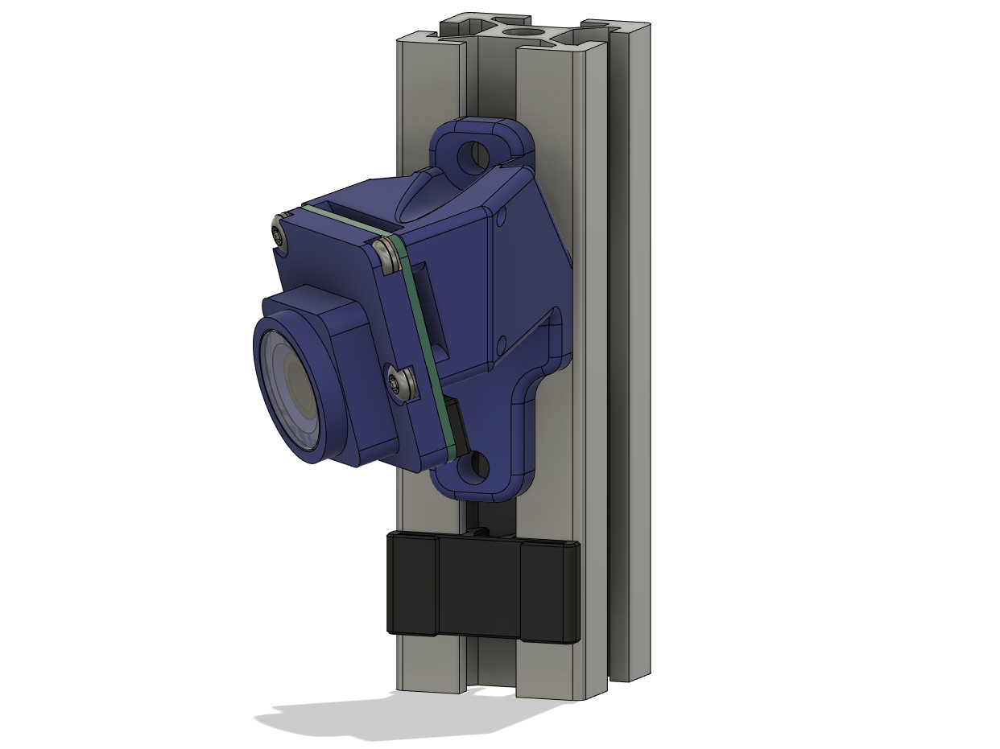
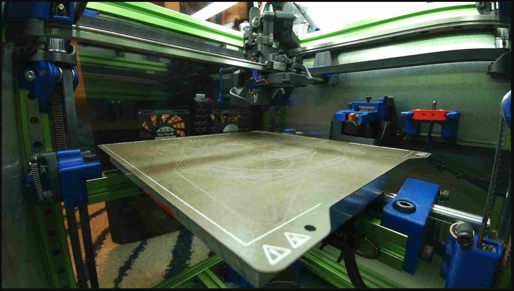
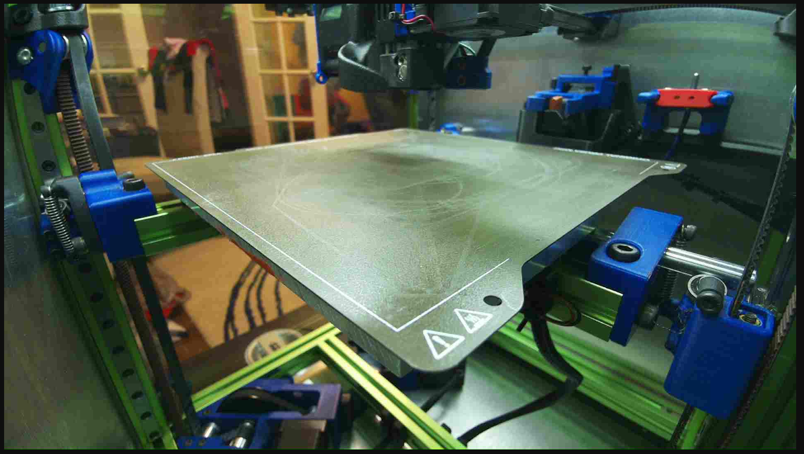
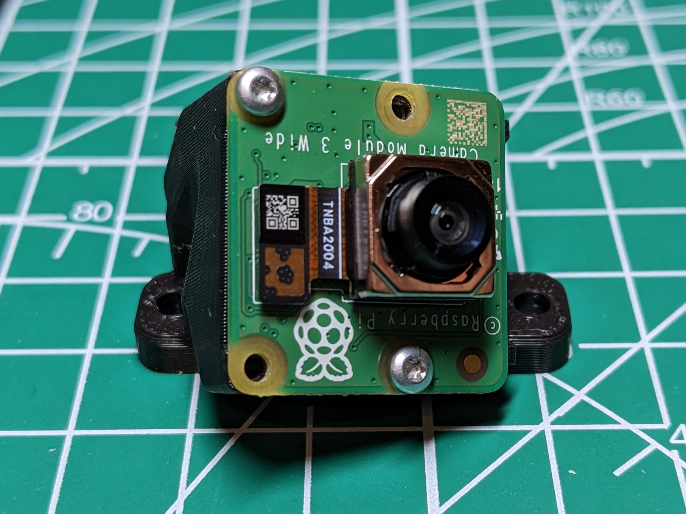
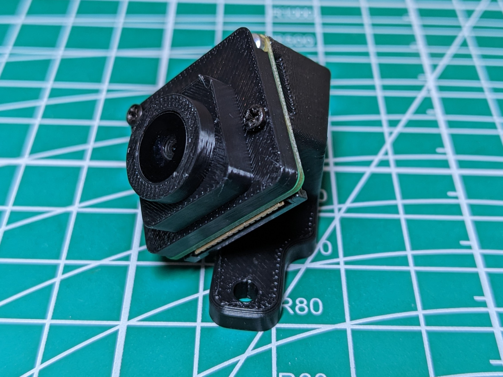
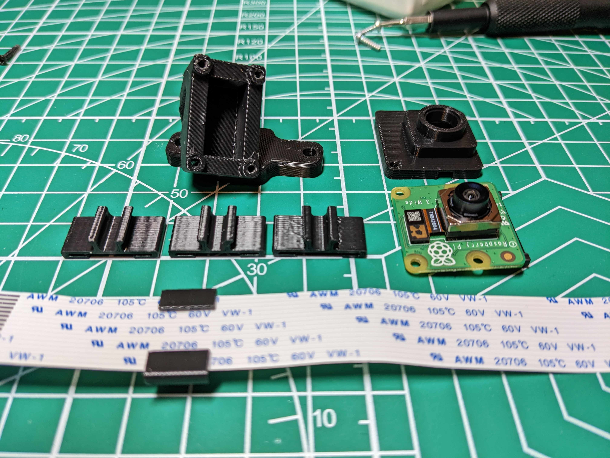
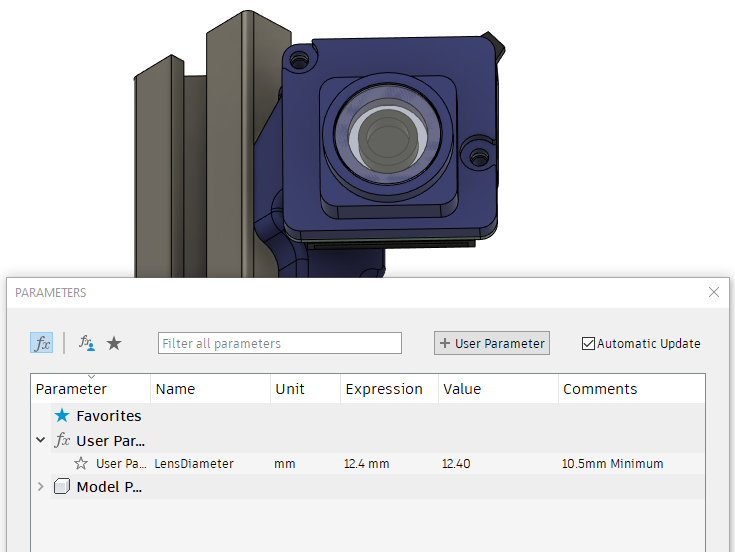

**Pi Camera V3 (wide) Mount**
============
<table width=100%>
<TR>
<TD width=50% align="center"></TD>
<TD width=50% align="center"></TD>
</TR>
<TR>
<TD width=50% align="center"> 15 Degree Tilt</TD>
<TD width=50% align="center"> 25 Degree Tilt</TD>
</TR>
<TR>
<TD width=50% align="center"></TD>
<TD width=50% align="center"></TD>
</TR>
<TR>
<TD width=50% align="center"></TD>
<TD width=50% align="center"></TD>
</TR>
</TABLE>

**Notes**
   - Mounts a Pi Camera V3 (wide) to the back right extrusion of K3.  
   - Angled 45 degrees horizontally.
   - STLS for 15 or 25 degrees of forward tilt.  
      - 25 Degree variant shows more of the build volume and only the very bottom of the toolhead.
      - 15 degree variant shows more of the toolhead, but less of the lower part of the build volume.  I don't generally print tall things, so I like the 15 degree better.
      - If a different angle is desired you can edit the construction plane called "Forward Tilt" in the fusion 360 file.
   - Lens Cover is optional.  I thought it'd be nice to protect the camera from the ABS fumes in my chamber and make it easier to clean.  
      - The included lens cover uses the replacement phone camera lens glass for an Iphone 13 pro which is 12.4mm diameter.   
      - If you have a different lens, I have made this easily modifiable in the fusion 360 file by modifying the user parameters.  You will want to have a lens that is at least 10.5mm diameter or the lens may obstruct the view.

**Build Instructions**
   - Attach Pi Camera to the mount using m2 self-tapping screws.  
      - *If using the lens cover*, use the top right and bottom left holes to mount the Pi Camera.  
      - The lens cover uses the other two holes.
   - m3x8mm screws to attach mount to 2020 extrusion.
   - Snap the ribbon holders into the extrusion.  
      - These work well for me, but I know there's different extrusions out there.  Let me know if you need some adjustments.
      - If you need to remove these later, it's easiest to stick  an allen wrench underneath and pop it up.

**BOM**
   - Pi Camera v3 wide.  This was all tested with the wide variant.  Not sure if the normal will work.
   - 4x m2x8-10mm screws.  Length here doesn't really matter, althought it may stick out on one side if yours are too long.
   - 2x m3x8mm BHCS or SHCS to attach mount to the 2020
   - 2x m3 t-nuts
   - **Optional* - 12.4mm Phone Glass Lens (from Iphone 13 PRO).  If you have a different lens ie from a old phone laying around, that will work too by editing the f360 file.
   - Long pi camera ribbon.  I used 1 meter.  My pi4 is mounted at the opposite corner, so it's a long stretch to get to the mounting location.  

**Printing**
   - No supports are necessary.
   - The lens cover has one support that is integrated into the STL.
